### 开篇：Vue CLI 3 项目构建基础

大家好，当你点进这个标题，开始阅读本章的时候，说明你对 `Vue.js` 是充满好奇心和求知欲的。我之前写过一篇文章，这样评价 Vue.js，称它是“简单却不失优雅，小巧而不乏大匠”的作品，正如其官网介绍的“易用，灵活和高效”那样。其实框架是 Vue.js 的本质，而真正了解它的人则会把它当成一件作品来欣赏。

### 依赖工具

在构建一个 Vue 项目前，我们先要确保你本地安装了` Node` 环境以及包管理工具` npm`，打开终端运行：

```shell
# 查看 node 版本
node -v

# 查看 npm 版本
npm -v
```

如果成功打印出版本号，说明你本地具备了 node 的运行环境，我们可以使用 npm 来安装管理项目的依赖，而如果没有或报错，则你需要去[ node 官网](https://nodejs.org/en/)进行 node 的下载及安装，如图：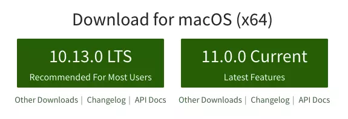

### 脚手架

当我们安装完 node 后便可以开始进行后续的构建工作了，那么这里我主要给大家介绍下最便捷的脚手架构建。

#### 1. 什么是脚手架

很多人可能经常会听到“脚手架”三个字，无论是前端还是后台，其实它在生活中的含义是为了保证各施工过程顺利进行而搭设的工作平台。因此作为一个工作平台，前端的脚手架可以理解为能够帮助我们快速构建前端项目的一个工具或平台。

#### 2. vue-cli

其实说到脚手架，目前很多主流的前端框架都提供了各自官方的脚手架工具，以帮助开发者快速构建起自己的项目，比如 `Vue`、`React` 等，这里我们就来介绍下 Vue 的脚手架工具 `vue-cli`。

vue-cli 经历了几个版本的迭代，目前最新的版本是 3.x，也是本小册构建项目所使用的版本，我们一起来看下其人性化的构建流程：

#### a. 安装

我们可以在终端通过以下命令全局安装 vue-cli：

```shell
# 安装 Vue CLI 3.x
npm i -g @vue/cli
```

如果你习惯使用 `yarn`，你也可以：

```shell
# 没有全局安装yarn需执行此命令
npm i -g yarn
yarn global add @vue/cli
```

注意因为是全局安装，所以 vue-cli 是全局的包，它和我们所处的项目没有关系。同时我们这里介绍的 CLI 版本是最新的 3.x，它和 2.x 版本存在着很大的区别，具体的讲解会在后续章节中进行介绍。

#### b. 构建

安装完 vue-cli 后，我们在你想要创建的项目目录地址下执行构建命令：

```shell
# my-project 是你的项目名称
vue create my-project
```

执行完上述命令后，会出现一系列的选择项，我们可以根据自己的需要进行选择，流程图如下：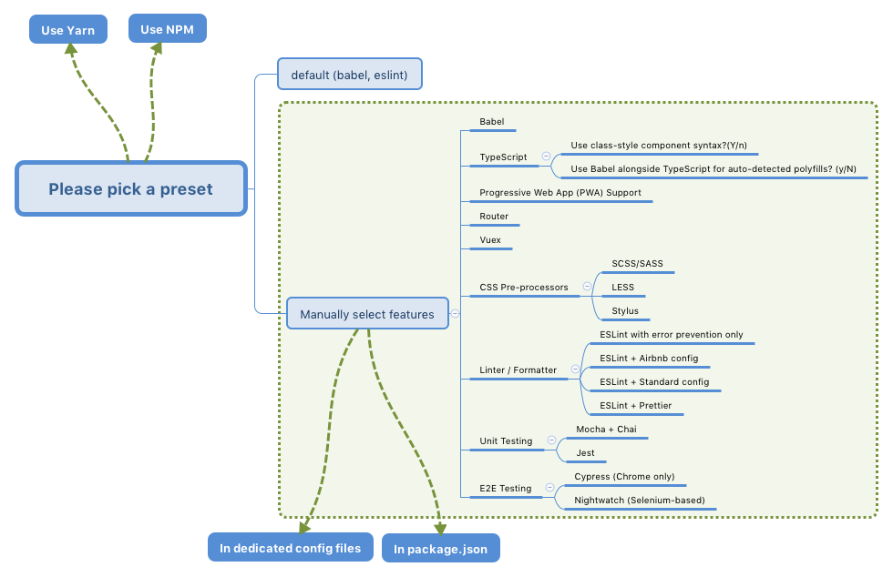

如果你只想构建一个基础的 Vue 项目，那么使用 `Babel`、`Router`、`Vuex`、`CSS Pre-processors` 就足够了，最后选择你喜欢的包管理工具 npm or yarn。

#### c. 启动

等待构建完成后你便可以运行命令来启动你的 Vue 项目：

```shell
# 打开项目目录
cd vue-project

# 启动项目
yarn serve

# or
npm run serve
```

需要注意的是如果启动的时候出现报错或者包丢失等情况，最好将 node 或者 yarn （如果使用）的版本更新到最新重新构建。

成功后打开浏览器地址：<http://localhost:8080/> 可以看到如下界面：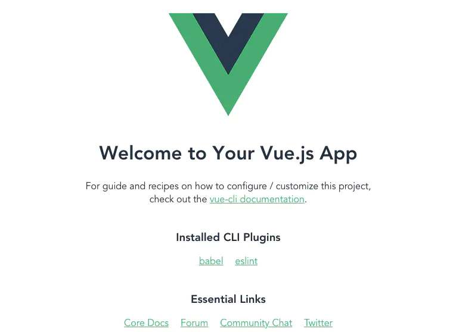

#### d. 目录结构

最后脚手架生成的目录结构如下：

```
├── node_modules     # 项目依赖包目录
├── public
│   ├── favicon.ico  # ico图标
│   └── index.html   # 首页模板
├── src 
│   ├── assets       # 样式图片目录
│   ├── components   # 组件目录
│   ├── views        # 页面目录
│   ├── App.vue      # 父组件
│   ├── main.js      # 入口文件
│   ├── router.js    # 路由配置文件
│   └── store.js     # vuex状态管理文件
├── .gitignore       # git忽略文件
├── .postcssrc.js    # postcss配置文件
├── babel.config.js  # babel配置文件
├── package.json     # 包管理文件
└── yarn.lock        # yarn依赖信息文件
```

根据你安装时选择的依赖不同，最后生成的目录结构也会有所差异。

### 3. 可视化界面

当然，除了使用上述命令行构建外，`vue-cli 3.x` 还提供了可视化的操作界面，在项目目录下我们运行如下命令开启图形化界面：

```
vue ui
```

之后浏览器会自动打开本地 `8000` 端口，页面如下：
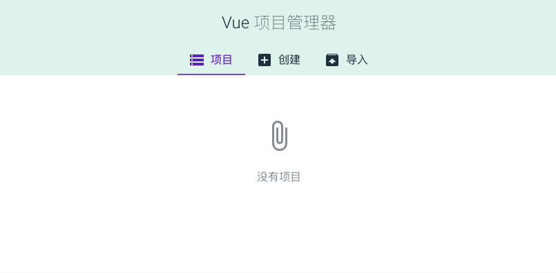

如果你还没有任何项目，那么可以点击创建或者直接导入现有的项目。创建项目和我们使用命令行的步骤基本相同，完全可视化操作，一定程度上降低了构建和使用的难度。项目创建或导入成功后你便可以进入项目进行可视化管理了。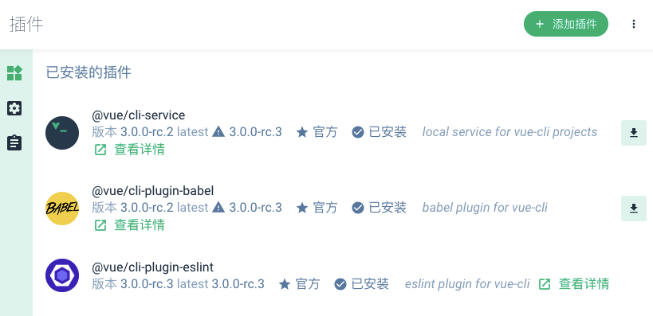

在整个管理界面中，我们可以为自己的项目安装 CLI 提供的插件，比如安装 `@vue/cli-plugin-babel` 插件，同时我们也可以配置相应插件的配置项，进行代码的编译、热更新、检查等。详细的操作大家可以自己进行手动尝试，相信你会发现意想不到的惊喜。

## 你还需要了解什么

上方我们用 vue-cli 成功生成了一个最基础的 Vue 项目，麻雀虽小，五脏俱全，但是想要让麻雀飞起来，我们还要不断的给它进行拓展训练，那么我们还需要了解什么呢？
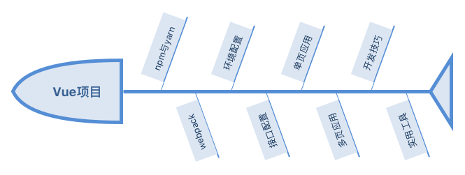


### 构建基础篇 1：你需要了解的包管理工具与配置项

任何一个项目的构建离不开工具和统一的管理标准，在项目开发和维护过程中，我们需要了解安装包的相应工具和配置文件，以此来有效的进行项目的迭代和版本的更新，为项目提供基本的运行环境。本文将详细介绍构建 Vue.js 项目相关的依赖包安装工具和相应的配置文件，为大家提供参考。

## 介绍

相信大家对于包管理工具的使用一定不会陌生，毕竟它已经成为前端项目中必不可少的一部分，为了照顾部分零基础用户，这里我们做一个简单的介绍。

### 1. npm 与 package.json

npm 是 Node Package Manager 的简称，顾名思义，它是 node 的包管理工具，也是目前世界上最大的开源库生态系统。官方地址为：[www.npmjs.com/](https://www.npmjs.com/)，你可以在里面找到数以万计的开源包。

使用 npm 包下载量统计工具，比如 [npm-start](https://npm-stat.com/)，我们可以查看相应包在一定时间范围内的下载量数据，下面是 `vue-cli` 和 `@vue/cli` 的下载量趋势：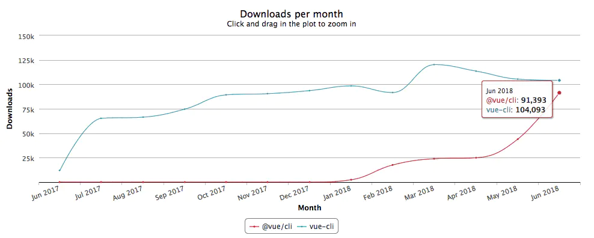

在上篇文章中我们介绍了使用 vue-cli 来构建自己的项目，并生成了相应的目录结构，而在最外层目录中，我们可以看到有 `package.json` 这一文件，该文件便是我们需要了解的包管理文件。

我们先来看一下该文件里面的内容：

```json
{
    "name": "my-project", 
    "version": "0.1.0", 
    "private": true, 
    "scripts": {
        "serve": "vue-cli-service serve",
        "build": "vue-cli-service build",
        "lint": "vue-cli-service lint"
    },
    "dependencies": {
        "vue": "^2.5.16",
        "vue-router": "^3.0.1",
        "vuex": "^3.0.1"
    },
    "devDependencies": {
        "@vue/cli-plugin-babel": "^3.0.0-beta.15",
        "@vue/cli-service": "^3.0.0-beta.15",
        "less": "^3.0.4",
        "less-loader": "^4.1.0",
        "vue-template-compiler": "^2.5.16"
    },
    "browserslist": [
        "> 1%",
        "last 2 versions",
        "not ie <= 8"
    ]
}
```

可以看到该文件是由一系列键值对构成的 JSON 对象，每一个键值对都有其相应的作用，比如 scripts 脚本命令的配置，我们在终端启动项目运行的 `npm run serve` 命令其实便是执行了 scripts 配置下的 serve 项命令 `vue-cli-service serve` ，我们可以在 scripts 下自己修改或添加相应的项目命令。

而 dependencies 和 devDependencies 分别为项目生产环境和开发环境的依赖包配置，也就是说像 `@vue/cli-service` 这样只用于项目开发时的包我们可以放在 devDependencies 下，但像 `vue-router` 这样结合在项目上线代码中的包应该放在 dependencies 下。

详细的package.json文件配置项介绍可以参考：[package.json](https://docs.npmjs.com/files/package.json)

### 2. 常用命令

在简单的了解了 package.json 文件后，我们再来看下包管理工具的常用命令。一般在项目的构建和开发阶段，我们常用的 npm 命令有：

```shell
# 生成 package.json 文件（需要手动选择配置）
npm init

# 生成 package.json 文件（使用默认配置）
npm init -y

# 一键安装 package.json 下的依赖包
npm i

# 在项目中安装包名为 xxx 的依赖包（配置在 dependencies 下）
npm i xxx

# 在项目中安装包名为 xxx 的依赖包（配置在 dependencies 下）
npm i xxx --save

# 在项目中安装包名为 xxx 的依赖包（配置在 devDependencies 下）
npm i xxx --save-dev

# 全局安装包名为 xxx 的依赖包
npm i -g xxx

# 运行 package.json 中 scripts 下的命令
npm run xxx
```

比较陌生但实用的有：

```shell
# 打开 xxx 包的主页
npm home xxx

# 打开 xxx 包的代码仓库
npm repo xxx

# 将当前模块发布到 npmjs.com，需要先登录
npm publish
```

相比 npm，[yarn](https://yarnpkg.com/zh-Hans/) 相信大家也不会陌生，它是由 facebook 推出并开源的包管理工具，具有速度快，安全性高，可靠性强等主要优势，它的常用命令如下：

```shell
# 生成 package.json 文件（需要手动选择配置）
yarn init

# 生成 package.json 文件（使用默认配置）
yarn init -y

# 一键安装 package.json 下的依赖包
yarn

# 在项目中安装包名为 xxx 的依赖包（配置在 dependencies 下）,同时 yarn.lock 也会被更新
yarn add xxx

# 在项目中安装包名为 xxx 的依赖包（配置在配置在 devDependencies 下）,同时 yarn.lock 也会被更新
yarn add xxx --dev

# 全局安装包名为 xxx 的依
yarn global add xxx

# 运行 package.json 中 scripts 下的命令
yarn xxx
```

比较陌生但实用的有：

```shell
# 列出 xxx 包的版本信息
yarn outdated xxx

# 验证当前项目 package.json 里的依赖版本和 yarn 的 lock 文件是否匹配
yarn check

# 将当前模块发布到 npmjs.com，需要先登录
yarn publish
```

以上便是 npm 与 yarn 包管理工具的常用及实用命令，需要注意的是，本小册的讲解将会优先使用 yarn 命令进行包的管理和安装。

### 3. 第三方插件配置

在上方的 package.json 文件中我们可以看到有 browserslist 这一配置项，那么该配置项便是这里所说的第三方插件配置，该配置的主要作用是用于在不同的前端工具之间共享目标浏览器和 Node.js 的版本：

```json
"browserslist": [
    "> 1%", // 表示包含所有使用率 > 1% 的浏览器
    "last 2 versions", // 表示包含浏览器最新的两个版本
    "not ie <= 8" // 表示不包含 ie8 及以下版本
]
```

比如像 [autoprefixer](https://www.npmjs.com/package/autoprefixer) 这样的插件需要把你写的 css 样式适配不同的浏览器，那么这里要针对哪些浏览器呢，就是上面配置中所包含的。

而如果写在 autoprefixer 的配置中，那么会存在一个问题，万一其他第三方插件也需要浏览器的包含范围用于实现其特定的功能，那么就又得在其配置中设置一遍，这样就无法得以共用。所以在 package.json 中配置 browserslist 的属性使得所有工具都会自动找到目标浏览器。

当然，你也可以单独写在 .browserslistrc 的文件中：

```shell
# Browsers that we support 

> 1%
last 2 versions
not ie <= 8
```

至于它是如何去衡量浏览器的使用率和版本的，数据都是来源于 [Can I Use](https://caniuse.com/)。你也可以访问 [browserl.ist/](http://browserl.ist/) 去搜索配置项所包含的浏览器列表，比如搜索 `last 2 versions` 会得到你想要的结果，或者在项目终端运行如下命令查看：

```
npx browserslist
```

除了上述插件的配置，项目中常用的插件还有：babel、postcss 等，有兴趣的同学可以访问其官网进行了解。

### 4. vue-cli 包安装

在上述的教程中，我们使用 npm 或 yarn 进行了包的安装和配置，除了以上两种方法，vue-cli 3.x 还提供了其专属的 `vue add` 命令，但是需要注意的是该命令安装的包是以 @vue/cli-plugin 或者 vue-cli-plugin 开头，即只能安装 Vue 集成的包。

比如运行：

```
vue add jquery
```

其会安装 `vue-cli-plugin-jquery`，很显然这个插件不存在便会安装失败。又或者你运行：

```
vue add @vue/eslint
```

其会解析为完整的包名 `@vue/cli-plugin-eslint`，因为该包存在所以会安装成功。

同时，不同于 npm 或 yarn 的安装， `vue add` 不仅会将包安装到你的项目中，其还会改变项目的代码或文件结构，所以安装前最好提交你的代码至仓库。

另外 vue add 中还有两个特例，如下：

```shell
# 安装 vue-router
vue add router

# 安装 vuex
vue add vuex
```

这两个命令会直接安装 vue-router 和 vuex 并改变你的代码结构，使你的项目集成这两个配置，并不会去安装添加 vue-cli-plugin 或 @vue/cli-plugin 前缀的包。

## 结语

不积跬步无以至千里，不积小流无以成江海。本文主要介绍了在 Vue 项目构建前期需要了解的包管理工具与配置的知识点，只有了解了基本的工具使用才能熟练的对项目进行按需配置，希望大家在接下来的学习中能够学以致用，付诸实践。

## 思考 & 作业

- 文章中使用的一些 npm 包名为什么要用 `@` 开头？
- 除了文章中介绍的 `browserslist` 这样的配置项可以写在单独的文件中外，还有哪些常用的配置项可以这样操作？又是如何配置的？
- Vue CLI 3 还集成了哪些包，可以通过 `vue add` 命令安装？


# 构建基础篇 2：webpack 在 CLI 3 中的应用

webpack 作为目前最流行的项目打包工具，被广泛使用于项目的构建和开发过程中，其实说它是打包工具有点大材小用了，我个人认为它是一个集前端自动化、模块化、组件化于一体的可拓展系统，你可以根据自己的需要来进行一系列的配置和安装，最终实现你需要的功能并进行打包输出。

而在 Vue 的项目中，webpack 同样充当着举足轻重的作用，比如打包压缩、异步加载、模块化管理等等。如果你了解 webpack 那么相信本文会让你更了解其在 Vue 中的使用，如果你是一个 webpack 小白，那么也没事，相信你会很容易的了解它在项目中的配置和功能。

## webpack 的使用

### 1. 与 vue-cli 2.x 的差异

如果你使用过 vue-cli 2.x，那么你应该了解其构建出的目录会包含相应的 webpack 配置文件，但是在 vue-cli 3.x 中你却见不到一份关于 webpack 的配置文件，难道 3.x 抛弃了 webpack？其实不然，3.x 提供了一种开箱即用的模式，即你无需配置 webpack 就可以运行项目，并且它提供了一个 vue.config.js 文件来满足开发者对其封装的 webpack 默认配置的修改。如图：

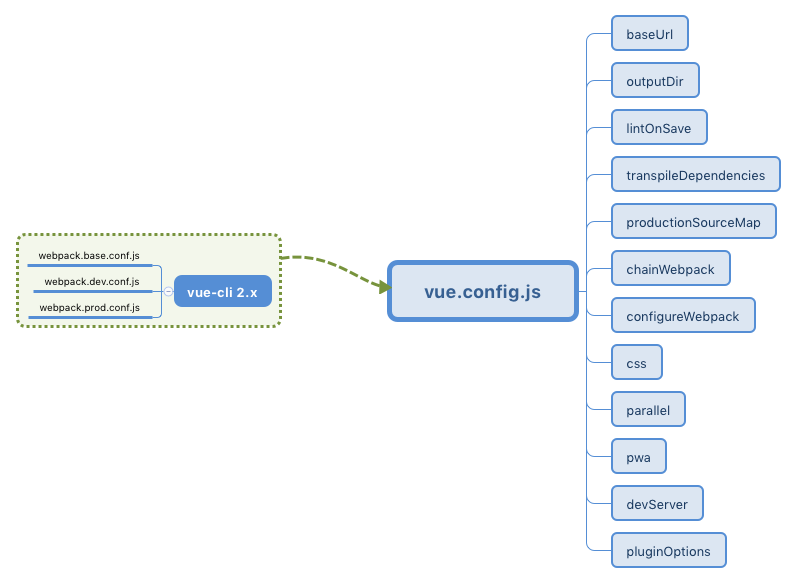

### 2. vue.config.js 的配置

通过上方新老版本的对比，我们可以清晰的看出 vue.config.js 的配置项结构，如果你构建的项目中没有该文件，那么你需要在根目录手动创建它。下面我们就来介绍一下其常用配置项的功能和用途：

### a. baseurl

在第一节《Vue CLI 3 项目构建基础》中我们通过 vue-cli 3.x 成功构建并在浏览器中打开 `http://localhost:8080/` 展示了项目首页。如果现在你想要将项目地址加一个二级目录，比如：`http://localhost:8080/vue/`，那么我们需要在 vue.config.js 里配置 baseurl 这一项：

```
// vue.config.js
module.exports = {
    ...
    
    baseUrl: 'vue',
    
    ...
}
```

其改变的其实是 webpack 配置文件中 output 的 `publicPath` 项，这时候你重启终端再次打开页面的时候我们首页的 url 就会变成带二级目录的形式。

### b. outputDir

如果你想将构建好的文件打包输出到 output 文件夹下（默认是 dist 文件夹），你可以配置：

```
// vue.config.js
module.exports = {
    ...
    
    outputDir: 'output',
    
    ...
}
```

然后运行命令 `yarn build` 进行打包输出，你会发现项目跟目录会创建 output 文件夹， 这其实改变了 webpack 配置中 output 下的 `path` 项，修改了文件的输出路径。

### c. productionSourceMap

该配置项用于设置是否为生产环境构建生成 source map，一般在生产环境下为了快速定位错误信息，我们都会开启 source map：

```
// vue.config.js
module.exports = {
    ...
    
    productionSourceMap: true,
    
    ...
}
```

该配置会修改 webpack 中 `devtool` 项的值为 `source-map`。

开启 source map 后，我们打包输出的文件中会包含 js 对应的 .map 文件，其用途可以参考：[JavaScript Source Map 详解](http://www.ruanyifeng.com/blog/2013/01/javascript_source_map.html)

### d. chainWebpack

chainWebpack 配置项允许我们更细粒度的控制 webpack 的内部配置，其集成的是 [webpack-chain](https://github.com/mozilla-neutrino/webpack-chain) 这一插件，该插件可以让我们能够使用链式操作来修改配置，比如：

```
// 用于做相应的合并处理
const merge = require('webpack-merge');

module.exports = {
    ...
    
    // config 参数为已经解析好的 webpack 配置
    chainWebpack: config => {
        config.module
            .rule('images')
            .use('url-loader')
            .tap(options =>
                merge(options, {
                  limit: 5120,
                })
            )
    }
    
    ...
}
```

以上操作我们可以成功修改 webpack 中 module 项里配置 rules 规则为图片下的 url-loader 值，将其 limit 限制改为 5M，修改后的 webpack 配置代码如下：

```json
{
    ...
    
    module: {
        rules: [
            {   
                /* config.module.rule('images') */
                test: /\.(png|jpe?g|gif|webp)(\?.*)?$/,
                use: [
                    /* config.module.rule('images').use('url-loader') */
                    {
                        loader: 'url-loader',
                        options: {
                            limit: 5120,
                            name: 'img/[name].[hash:8].[ext]'
                        }
                    }
                ]
            }
        ]
    }
    
    ...
}
```

这里需要注意的是我们使用了 webpack-merge 这一插件，该插件用于做 webpack 配置的合并处理，这样 options 下面的其他值就不会被覆盖或改变。

关于 webpack-chain 的使用可以参考其 github 官方地址：[github.com/mozilla-neu…](https://github.com/mozilla-neutrino/webpack-chain)，它提供了操作类似 JavaScript Set 和 Map 的方式，以及一系列速记方法。

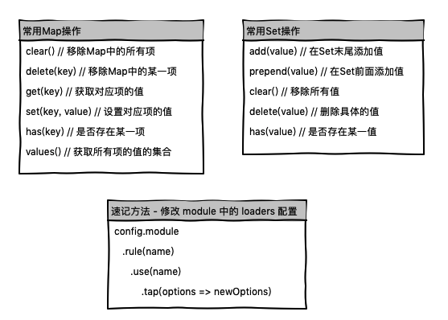

### e. configureWebpack

除了上述使用 chainWebpack 来改变 webpack 内部配置外，我们还可以使用 configureWebpack 来进行修改，两者的不同点在于 chainWebpack 是链式修改，而 configureWebpack 更倾向于整体替换和修改。示例代码如下：

```
// vue.config.js
module.exports = {
    ...
    
    // config 参数为已经解析好的 webpack 配置
    configureWebpack: config => {
        // config.plugins = []; // 这样会直接将 plugins 置空
        
        // 使用 return 一个对象会通过 webpack-merge 进行合并，plugins 不会置空
        return {
            plugins: []
        }
    }
    
    ...
}
```

configureWebpack 可以直接是一个对象，也可以是一个函数，如果是对象它会直接使用 webpack-merge 对其进行合并处理，如果是函数，你可以直接使用其 config 参数来修改 webpack 中的配置，或者返回一个对象来进行 merge 处理。

你可以在项目目录下运行 `vue inspect` 来查看你修改后的 webpack 完整配置，当然你也可以缩小审查范围，比如：

```
# 只查看 plugins 的内容
vue inspect plugins
```

### f. devServer

vue.config.js 还提供了 devServer 项用于配置 webpack-dev-server 的行为，使得我们可以对本地服务器进行相应配置，我们在命令行中运行的 `yarn serve` 对应的命令 `vue-cli-service serve` 其实便是基于 webpack-dev-server 开启的一个本地服务器，其常用配置参数如下：

```
// vue.config.js
module.exports = {
    ...
    
    devServer: {
        open: true, // 是否自动打开浏览器页面
        host: '0.0.0.0', // 指定使用一个 host。默认是 localhost
        port: 8080, // 端口地址
        https: false, // 使用https提供服务
        proxy: null, // string | Object 代理设置
        
        // 提供在服务器内部的其他中间件之前执行自定义中间件的能力
        before: app => {
          // `app` 是一个 express 实例
        }
    }
    
    ...
}
```

当然除了以上参数，其支持所有的 webpack-dev-server 中的选项，比如 `historyApiFallback` 用于重写路由（会在后续的多页应用配置中讲解）、progress 将运行进度输出到控制台等，具体可参考：[devServer](https://www.webpackjs.com/configuration/dev-server/)

以上讲解了 vue.config.js 中一些常用的配置项功能，具体的配置实现需要结合实际项目进行，完整的配置项可以查看：[vue.config.js](https://github.com/vuejs/vue-cli/blob/ce3e2d475d63895cbb40f62425bb6b3237469bcd/docs/zh/config/README.md)

### 3. 默认插件简介

通过对 vue.config.js 的了解，我们知道了 vue-cli 3.x 为我们默认封装了项目运行的常用 webpack 配置，那么它给我们提供了哪些默认插件，每一个 plugin 又有着怎样的用途呢？除了使用 `vue inspect plugins` 我们还可以通过运行 `vue ui` 进入可视化页面查看，步骤如下：

- 打开可视化页面，点击对应项目进入管理页面（如果没有对应项目，需要导入或新建）
- 点击侧边栏 Tasks 选项，再点击二级栏 inspect 选项
- 点击 Run task 按钮执行审查命令


如图所示：

最后我们从输出的内容中找到 plugins 数组，其包含了如下插件（配置项已经省略，增加了定义插件的代码）：

```
// vue-loader是 webpack 的加载器，允许你以单文件组件的格式编写 Vue 组件
const VueLoaderPlugin = require('vue-loader/lib/plugin');

// webpack 内置插件，用于创建在编译时可以配置的全局常量
const { DefinePlugin } = require('webpack');

// 用于强制所有模块的完整路径必需与磁盘上实际路径的确切大小写相匹配
const CaseSensitivePathsPlugin = require('case-sensitive-paths-webpack-plugin');

// 识别某些类型的 webpack 错误并整理，以提供开发人员更好的体验。
const FriendlyErrorsPlugin = require('friendly-errors-webpack-plugin');

// 将 CSS 提取到单独的文件中，为每个包含 CSS 的 JS 文件创建一个 CSS 文件
const MiniCssExtractPlugin = require("mini-css-extract-plugin");

// 用于在 webpack 构建期间优化、最小化 CSS文件
const OptimizeCssnanoPlugin = require('optimize-css-assets-webpack-plugin');

// webpack 内置插件，用于根据模块的相对路径生成 hash 作为模块 id, 一般用于生产环境
const { HashedModuleIdsPlugin } = require('webpack');

// 用于根据模板或使用加载器生成 HTML 文件
const HtmlWebpackPlugin = require('html-webpack-plugin');

// 用于在使用 html-webpack-plugin 生成的 html 中添加 <link rel ='preload'> 或 <link rel ='prefetch'>，有助于异步加载
const PreloadPlugin = require('preload-webpack-plugin');

// 用于将单个文件或整个目录复制到构建目录
const CopyWebpackPlugin = require('copy-webpack-plugin');

module.exports = {
    plugins: [
        /* config.plugin('vue-loader') */
        new VueLoaderPlugin(), 
        
        /* config.plugin('define') */
        new DefinePlugin(),
        
        /* config.plugin('case-sensitive-paths') */
        new CaseSensitivePathsPlugin(),
        
        /* config.plugin('friendly-errors') */
        new FriendlyErrorsWebpackPlugin(),
        
        /* config.plugin('extract-css') */
        new MiniCssExtractPlugin(),
        
        /* config.plugin('optimize-css') */
        new OptimizeCssnanoPlugin(),
        
        /* config.plugin('hash-module-ids') */
        new HashedModuleIdsPlugin(),
        
        /* config.plugin('html') */
        new HtmlWebpackPlugin(),
        
        /* config.plugin('preload') */
        new PreloadPlugin(),
        
        /* config.plugin('copy') */
        new CopyWebpackPlugin()
    ]
}
```

我们可以看到每个插件上方都添加了使用 chainWebpack 访问的方式，同时我也添加了每个插件相应的用途注释，需要注意的是要区分 webpack 内置插件和第三方插件的区别，如果是内置插件则无需安装下载，而外部插件大家可以直接访问：[www.npmjs.com/](https://www.npmjs.com/) 搜索对应的插件，了解其详细的 api 设置。

## 结语

本文主要阐述了 vue-cli 3.x 下基于 vue.config.js 配置 webpack 的主要方法，同时也介绍了其默认的 webpack 插件与主要功能，相信大家在了解 webpack 的知识后能够更加轻松的开展后续内容的学习，为接下来项目的构建和开发奠定基础。

## 思考 & 作业

- 除了文章中介绍的配置项，`vue.config.js` 中还有哪些额外的配置？
- `webpack-merge` 的合并原理是怎样的？
- 使用 `chainWebpack` 获取到 webpack 中的某一插件后，如何修改其配置？


# 构建基础篇 3：env 文件与环境设置

在实际项目的开发中，我们一般会经历项目的开发阶段、测试阶段和最终上线阶段，每一个阶段对于项目代码的要求可能都不尽相同，那么我们如何能够游刃有余的在不同阶段下使我们的项目呈现不同的效果，使用不同的功能呢？这里就需要引入**环境**的概念。

一般一个项目都会有以下 3 种环境：

- 开发环境（开发阶段，本地开发版本，一般会使用一些调试工具或额外的辅助功能）
- 测试环境（测试阶段，上线前版本，除了一些 bug 的修复，基本不会和上线版本有很大差别）
- 生产环境（上线阶段，正式对外发布的版本，一般会进行优化，关掉错误报告）

作为一名开发人员，我们可能需要针对每一种环境编写一些不同的代码并且保证这些代码运行在正确的环境中，那么我们应该如何在代码中判断项目所处的环境同时执行不同的代码呢？这就需要我们进行正确的环境配置和管理。

## 介绍

### 1. 配置文件

正确的配置环境首先需要我们认识不同环境配置之间的关系，如图所示：


我们从上图中可以了解到每一个环境其实有其不同的配置，同时它们也存在着交集部分，交集便是它们都共有的配置项，那么在 Vue 中我们应该如何处理呢？

我们可以在根目录下创建以下形式的文件进行不同环境下变量的配置：

```
.env                # 在所有的环境中被载入
.env.local          # 在所有的环境中被载入，但会被 git 忽略
.env.[mode]         # 只在指定的模式中被载入
.env.[mode].local   # 只在指定的模式中被载入，但会被 git 忽略
```

比如我们创建一个名为 .env.stage 的文件，该文件表明其只在 stage 环境下被加载，在这个文件中，我们可以配置如下键值对的变量：

```
NODE_ENV=stage
VUE_APP_TITLE=stage mode
```

这时候我们怎么在 vue.config.js 中访问这些变量呢？很简单，使用 `process.env.[name]` 进行访问就可以了，比如：

```
// vue.config.js

console.log(process.env.NODE_ENV); // development（在终端输出）
```

当你运行 `yarn serve` 命令后会发现输出的是 development，因为 `vue-cli-service serve` 命令默认设置的环境是 development，你需要修改 package.json 中的 serve 脚本的命令为：

```
"scripts": {
    "serve": "vue-cli-service serve --mode stage",
}
```

`--mode stage` 其实就是修改了 webpack 4 中的 mode 配置项为 stage，同时其会读取对应 .env.[model] 文件下的配置，如果没找到对应配置文件，其会使用默认环境 development，同样 `vue-cli-service build` 会使用默认环境 production。

这时候如果你再创建一个 .env 的文件，再次配置重复的变量，但是值不同，如：

```
NODE_ENV=staging
VUE_APP_TITLE=staging mode
VUE_APP_NAME=project
```

因为 .env 文件会被所有环境加载，即公共配置，那么最终我们运行 `vue-cli-service serve` 打印出来的是哪个呢？答案是 **stage**，但是如果是 .env.stage.local 文件中配置成上方这样，答案便是 **staging**，所以 .env.[mode].local 会覆盖 .env.[mode] 下的相同配置。同理 .env.local 会覆盖 .env 下的相同配置。

由此可以得出结论，相同配置项的权重：

```
.env.[mode].local > .env.[mode] > .env.local > .env 
```

但是需要注意的是，除了相同配置项权重大的覆盖小的，不同配置项它们会进行合并操作，类似于 Javascript 中的 Object.assign 的用法。

### 2. 环境注入

通过上述配置文件的创建，我们成功使用命令行的形式对项目环境进行了设置并可以自由切换，但是需要注意的是我们在 Vue 的前端代码中打印出的 `process.env` 与 vue.config.js 中输出的可能是不一样的，这需要普及一个知识点：webpack 通过 DefinePlugin 内置插件将 process.env 注入到客户端代码中。

```
// webpack 配置
{
    ...
    
    plugins: [
        new webpack.DefinePlugin({
            'process.env': {
                NODE_ENV: JSON.stringify(process.env.NODE_ENV)
            }
        }),
    ],
    
    ...
}
```

由于 vue-cli 3.x 封装的 webpack 配置中已经帮我们完成了这个功能，所以我们可以直接在客户端代码中打印出 process.env 的值，该对象可以包含多个键值对，也就是说可以注入多个值，但是经过 CLI 封装后仅支持注入环境配置文件中以 `VUE_APP_` 开头的变量，而 `NODE_ENV` 和 `BASE_URL` 这两个特殊变量除外。比如我们在权重最高的 .env.stage.local 文件中写入：

```
NODE_ENV=stage2
VUE_APP_TITLE=stage mode2
NAME=vue
```

然后我们尝试在 vue.config.js 中打印 `process.env`，终端输出：

```
{
    ...
    
    npm_config_ignore_scripts: '',
    npm_config_version_git_sign: '',
    npm_config_ignore_optional: '',
    npm_config_init_version: '1.0.0',
    npm_package_dependencies_vue_router: '^3.0.1',
    npm_config_version_tag_prefix: 'v',
    npm_node_execpath: '/usr/local/bin/node',
    NODE_ENV: 'stage2',
    VUE_APP_TITLE: 'stage mode2',
    NAME: 'vue',
    BABEL_ENV: 'development',
    
    ...
}
```

可以看到输出内容除了我们环境配置中的变量外还包含了很多 npm 的信息，但是我们在入口文件 main.js 中打印会发现输出：

```
{
    "BASE_URL": "/vue/",
    "NODE_ENV": "stage2",
    "VUE_APP_TITLE": "stage mode2"
}
```

可见注入时过滤调了非 `VUE_APP_` 开头的变量，其中多出的 `BASE_URL` 为你在 vue.config.js 设置的值，默认为 /，其在环境配置文件中设置无效。
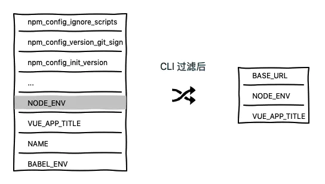


### 3. 额外配置

以上我们通过新建配置文件的方式为项目不同环境配置不同的变量值，能够实现项目基本的环境管理，但是 .env 这样的配置文件中的参数目前只支持静态值，无法使用动态参数，在某些情况下无法实现特定需求，这时候我们可以在根目录下新建 config 文件夹用于存放一些额外的配置文件。

```
/* 配置文件 index.js */

// 公共变量
const com = {
    IP: JSON.stringify('xxx')
};

module.exports = {

    // 开发环境变量
    dev: {
    	env: {
            TYPE: JSON.stringify('dev'),
            ...com
    	}
    },
    
    // 生产环境变量
    build: {
    	env: {
            TYPE: JSON.stringify('prod'),
            ...com
    	}
    }
}
```

上方代码我们把环境变量分为了公共变量、开发环境变量和生产环境变量，当然这些变量可能是动态的，比如用户的 ip 等。现在我们要在 vue.config.js 里注入这些变量，我们可以使用 chainWebpack 修改 DefinePlugin 中的值：

```
/* vue.config.js */
const configs = require('./config');

// 用于做相应的 merge 处理
const merge = require('webpack-merge');

// 根据环境判断使用哪份配置
const cfg = process.env.NODE_ENV === 'production' ? configs.build.env : configs.dev.env;

module.exports = {
    ...
    
    chainWebpack: config => {
        config.plugin('define')
            .tap(args => {
                let name = 'process.env';
                
                // 使用 merge 保证原始值不变
                args[0][name] = merge(args[0][name], cfg);
    
                return args
            })
    },
	
    ...
}
```

最后我们可以在客户端成功打印出包含动态配置的对象：

```
{
    "NODE_ENV": "stage2",
    "VUE_APP_TITLE": "stage mode2",
    "BASE_URL": "/vue/",
    "TYPE": "dev",
    "IP": "xxx"
}
```

### 4. 实际场景

结合以上环境变量的配置，我们项目中一般会遇到一些实际场景： 比如在非线上环境我们可以给自己的移动端项目开启 [vConsole](https://github.com/Tencent/vConsole) 调试，但是在线上环境肯定不需要开启这一功能，我们可以在入口文件中进行设置，代码如下：

```
/* main.js */

import Vue from 'vue'
import App from './App.vue'
import router from './router'
import store from './store'

Vue.config.productionTip = false

// 如果是非正式环境，加载 VConsole
if (process.env.NODE_ENV !== 'production') {
    var VConsole = require('vconsole/dist/vconsole.min.js');
    var vConsole = new VConsole();
}

new Vue({
  router,
  store,
  render: h => h(App)
}).$mount('#app')
```

vConsole 是一款用于移动网页的轻量级，可扩展的前端开发工具，可以看作是移动端浏览器的控制台，如图：

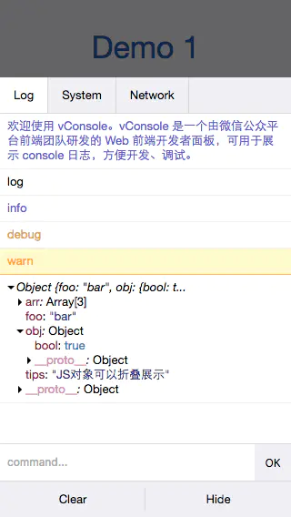

另外我们还可以使用配置中的 BASE_URL 来设置路由的 base 参数：

```
/* router.js */

import Vue from 'vue'
import Router from 'vue-router'
import Home from './views/Home.vue'
import About from './views/About.vue'

Vue.use(Router)

let base = `${process.env.BASE_URL}`; // 获取二级目录

export default new Router({
    mode: 'history',
    base: base, // 设置 base 值
    routes: [
        {
            path: '/',
            name: 'home',
            component: Home
        },
        {
            path: '/about',
            name: 'about',
            component: About
        }
    ]
})
```

每一个环境变量你都可以用于项目的一些地方，它提供给了我们一种全局的可访问形式，也是基于 Node 开发的特性所在。

## 结语

环境的配置和管理对于项目的构建起到了至关重要的作用，通过给项目配置不同的环境不仅可以增加开发的灵活性、提高程序的拓展性，同时也有助于帮助我们去了解并分析项目在不同环境下的运行机制，建立全局观念。

## 思考 & 作业

- webpack 通过 DefinePlugin 内置插件将 process.env 注入到客户端代码中时，`process.env.NODE_ENV` 为什么要进行 JSON.stringify 处理？
- `process.env` 中如何获取 package.json 中 name 的值？
- 如何在 package.json 中的 scripts 字段中定义一些自定义脚本来切换不同的环境？