# 构建实战篇 1：单页应用的基本配置

前几篇文章我们介绍了 Vue 项目构建及运行的前期工作，包括 webpack 的配置、环境变量的使用等，在了解并掌握了这些前期准备工作后，那么接下来我们可以走进 Vue 项目的内部，一探其内部配置的基本构成。

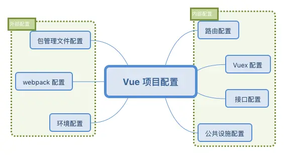

## 配置

### 1. 路由配置

由于 Vue 这类型的框架都是以一个或多个单页构成，在单页内部跳转并不会重新渲染 HTML 文件，其路由可以由前端进行控制，因此我们需要在项目内部编写相应的路由文件，Vue 会解析这些文件中的配置并进行对应的跳转渲染。

我们来看一下 CLI 给我们生成的 router.js 文件的配置：

```javascript
/* router.js */

import Vue from 'vue'
import Router from 'vue-router'
import Home from './views/Home.vue' // 引入 Home 组件
import About from './views/About.vue' // 引入 About 组件

Vue.use(Router) // 注册路由

export default new Router({
    routes: [{
        path: '/',
        name: 'home',
        component: Home
    }, {
        path: '/about',
        name: 'about',
        component: About
    }]
})
```

这份配置可以算是最基础的路由配置，有以下几点需要进行优化：

- 如果路由存在二级目录，需要添加 base 属性，否则默认为 "/"
- 默认路由模式是 hash 模式，会携带 # 标记，与真实 url 不符，可以改为 history 模式
- 页面组件没有进行按需加载，可以使用 `require.ensure()` 来进行优化

下面是我们优化结束的代码：

```javascript
/* router.js */

import Vue from 'vue'
import Router from 'vue-router'

// 引入 Home 组件
const Home = resolve => {
    require.ensure(['./views/Home.vue'], () => {
        resolve(require('./views/Home.vue'))
    })
}

// 引入 About 组件
const About = resolve => {
    require.ensure(['./views/About.vue'], () => {
        resolve(require('./views/About.vue'))
    })
}

Vue.use(Router)

let base = `${process.env.BASE_URL}` // 动态获取二级目录

export default new Router({
    mode: 'history',
    base: base,
    routes: [{
        path: '/',
        name: 'home',
        component: Home
    }, {
        path: '/about',
        name: 'about',
        component: About
    }]
})
```

改为 history 后我们 url 的路径就变成了 `http://127.0.0.1:8080/vue/about`，而不是原来的 `http://127.0.0.1:8080/vue/#/about`，但是需要注意页面渲染 404 的问题，具体可查阅：[HTML5 History 模式](https://router.vuejs.org/zh/guide/essentials/history-mode.html)。

而在异步加载的优化上，我们使用了 webpack 提供的 require.ensure() 进行了代码拆分，主要区别在于没有优化前，访问 Home 页面会一起加载 About 组件的资源，因为它们打包进了一个 app.js 中：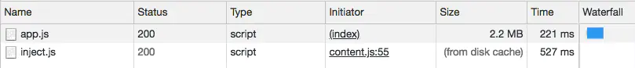

但是优化过后，它们分别被拆分成了 2.js 和 3.js：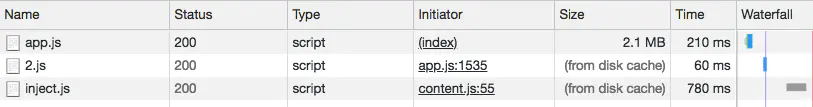

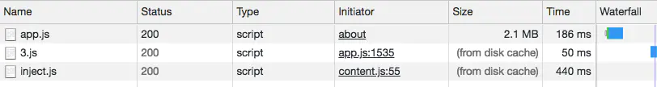

如此，只有当用户点击了某页面，才会加载对应页面的 js 文件，实现了按需加载的功能。

> webpack 在编译时，会静态地解析代码中的 require.ensure()，同时将模块添加到一个分开的 chunk 当中。这个新的 chunk 会被 webpack 通过 jsonp 来按需加载。

关于 `require.ensure()` 的知识点可以参考官方文档：[require.ensure](https://webpack.js.org/api/module-methods/#require-ensure)。

当然，除了使用 require.ensure 来拆分代码，[Vue Router](https://router.vuejs.org/zh/guide/advanced/lazy-loading.html#%E6%8A%8A%E7%BB%84%E4%BB%B6%E6%8C%89%E7%BB%84%E5%88%86%E5%9D%97) 官方文档还推荐使用动态 `import` 语法来进行代码分块，比如上述 require.ensure 代码可以修改为：

```
// 引入 Home 组件
const Home = () => import('./views/Home.vue');

// 引入 About 组件
const About = () => import('./views/About.vue');
```

其余代码可以保持不变，仍然可以实现同样的功能。如果你想给拆分出的文件命名，可以尝试一下 webpack 提供的 `Magic Comments`（魔法注释）：

```
const Home = () => import(/* webpackChunkName:'home'*/ './views/Home.vue');
```

### 2. Vuex 配置

除了 vue-router，如果你的项目需要用到 [Vuex](https://vuex.vuejs.org/zh/) ，那么你应该对它有一定的了解，Vuex 是一个专为 Vue.js 应用程序开发的状态管理模式。这里我们先来看一下使用 CLI 生成的配置文件 store.js 中的内容：

```javascript
import Vue from 'vue'
import Vuex from 'vuex'

Vue.use(Vuex)

export default new Vuex.Store({
    state: {

    },
    mutations: {

    },
    actions: {

    }
})
```

该配置文件便是 Vuex 的配置文件，主要有 4 个核心点：state、mutations、actions 及 getter，详细的介绍大家可以参考官方文档：[核心概念](https://vuex.vuejs.org/zh/guide/state.html)，这里我用一句话介绍它们之间的关系就是：**我们可以通过 actions 异步提交 mutations 去 修改 state 的值并通过 getter 获取**。

需要注意的是不是每一个项目都适合使用 Vuex，如果你的项目是中大型项目，那么使用 Vuex 来管理错综复杂的状态数据是很有帮助的，而为了后期的拓展性和可维护性，这里不建议使用 CLI 生成的一份配置文件来管理所有的状态操作，我们可以把它拆分为以下目录：

```shell
└── store
    ├── index.js          # 我们组装模块并导出 store 的地方
    ├── actions.js        # 根级别的 action
    ├── mutations.js      # 根级别的 mutation
    └── modules
        ├── moduleA.js    # A模块
        └── moduleB.js    # B模块
```

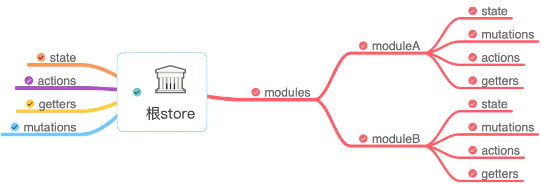

与单个 store.js 文件不同的是，我们按模块进行了划分，每个模块中都可以包含自己 4 个核心功能。比如模块 A 中：

```
/* moduleA.js */

const moduleA = {
    state: { 
        text: 'hello'
    },
    mutations: {
        addText (state, txt) {
            // 这里的 `state` 对象是模块的局部状态
            state.text += txt
        }
    },
    
    actions: {
        setText ({ commit }) {
            commit('addText', ' world')
        }
    },

    getters: {
        getText (state) {
            return state.text + '!'
        }
    }
}

export default moduleA
```

上方我们导出 A 模块，并在 index.js 中引入：

```javascript
/* index.js */

import Vue from 'vue'
import Vuex from 'vuex'
import moduleA from './modules/moduleA'
import moduleB from './modules/moduleB'
import { mutations } from './mutations'
import actions from './actions'

Vue.use(Vuex)

export default new Vuex.Store({
    state: {
        groups: [1]
    },
    modules: {
        moduleA, // 引入 A 模块
        moduleB, // 引入 B 模块
    },
    actions, // 根级别的 action
    mutations, // 根级别的 mutations
    
    // 根级别的 getters
    getters: {
        getGroups (state) {
            return state.groups
        }
    }   
})
```

这样项目中状态的模块划分就更加清晰，对应模块的状态我们只需要修改相应模块文件即可。详细的案例代码可参考文末 github 地址。

### 3. 接口配置

在项目的开发过程中，我们也少不了与后台服务器进行数据的获取和交互，这一般都是通过接口完成的，那么我们如何进行合理的接口配置呢？我们可以在 src 目录下新建 services 文件夹用于存放接口文件：

```
└── src
    └── services
        ├── http.js      # 接口封装
        ├── moduleA.js    # A模块接口
        └── moduleB.js    # B模块接口
```

为了让接口便于管理，我们同样使用不同的文件来配置不同模块的接口，同时由于接口的调用 ajax 请求代码重复部分较多，我们可以对其进行简单的封装，比如在 http.js 中（fetch为例）：

```javascript
/* http.js */
import 'whatwg-fetch'

// HTTP 工具类
export default class Http {
    static async request(method, url, data) {
        const param = {
            method: method,
            headers: {
                'Content-Type': 'application/json'
            }
        };

        if (method === 'GET') {
            url += this.formatQuery(data)
        } else {
            param['body'] = JSON.stringify(data)
        }

        // Tips.loading(); // 可调用 loading 组件

        return fetch(url, param).then(response => this.isSuccess(response))
                .then(response => {
                    return response.json()
            })
    }

    // 判断请求是否成功
    static isSuccess(res) {
        if (res.status >= 200 && res.status < 300) {
            return res
        } else {
            this.requestException(res)
        }
    }

    // 处理异常
    static requestException(res) {
        const error = new Error(res.statusText)

        error.response = res

        throw error
    }
    
    // url处理
    static formatQuery(query) {
        let params = [];

        if (query) {
            for (let item in query) {
                let vals = query[item];
                if (vals !== undefined) {
                    params.push(item + '=' + query[item])
                }
            }
        }
        return params.length ? '?' + params.join('&') : '';
    }
    
    // 处理 get 请求
    static get(url, data) {
        return this.request('GET', url, data)
    }
    
    // 处理 put 请求
    static put(url, data) {
        return this.request('PUT', url, data)
    }
    
    // 处理 post 请求
    static post(url, data) {
        return this.request('POST', url, data)
    }
    
    // 处理 patch 请求
    static patch(url, data) {
        return this.request('PATCH', url, data)
    }
    
    // 处理 delete 请求
    static delete(url, data) {
        return this.request('DELETE', url, data)
    }
}
```

封装完毕后我们在 moduleA.js 中配置一个 github 的开放接口：`https://api.github.com/repos/octokit/octokit.rb`

```
/* moduleA.js */
import Http from './http'

// 获取测试数据
export const getTestData = () => {
    return Http.get('https://api.github.com/repos/octokit/octokit.rb')
}
```

然后在项目页面中进行调用，会成功获取 github 返回的数据，但是一般我们在项目中配置接口的时候会直接省略项目 url 部分，比如：

```
/* moduleA.js */
import Http from './http'

// 获取测试数据
export const getTestData = () => {
    return Http.get('/repos/octokit/octokit.rb')
}
```

这时候我们再次调用接口的时候会发现其调用地址为本地地址：`http://127.0.0.1:8080/repos/octokit/octokit.rb`，那么为了让其指向 `https://api.github.com`，我们需要在 vue.config.js 中进行 devServer 的配置：

```javascript
/* vue.config.js */

module.exports = {
    ...
    
    devServer: {
    
        // string | Object 代理设置
        proxy: {
        
            // 接口是 '/repos' 开头的才用代理
            '/repos': {
                target: 'https://api.github.com', // 目标地址
                changeOrigin: true, // 是否改变源地址
                // pathRewrite: {'^/api': ''}
            }
        },
    }
    
    ...
}
```

在 devServer 中 我们配置 proxy 进行接口的代理，将我们本地地址转换为真实的服务器地址，此时我们同样能顺利的获取到数据，不同点在于接口状态变成了 304（重定向）：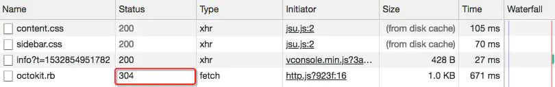

### 4. 公共设施配置

最后我们项目开发中肯定需要对一些公共的方法进行封装使用，这里我把它称之为公共设施，那么我们可以在 src 目录下建一个 common 文件夹来存放其配置文件：

```
└── src
    └── common
        ├── index.js      # 公共配置入口
        ├── validate.js   # 表单验证配置
        └── other.js      # 其他配置
```

在入口文件中我们可以向外暴露其他功能配置的模块，比如：

```
/* index.js */
import Validate from './validate'
import Other from './other'

export {
    Validate,
    Other,
}
```

这样我们在页面中只需要引入一个 index.js 即可。

## 结语

本文介绍了 Vue 单页应用的一些基本配置，从项目构建层面阐述了各文件的主要配置方式和注意点，由于本文并不是一篇文档类的配置说明，并不会详细介绍各配置文件的 API 功能，大家可以访问文中列出的官方文档进行查阅。

本案例代码地址：[single-page-project](https://github.com/luozhihao/vue-project-code/tree/master/single-page-project)

## 思考 & 作业

- devServer 中 proxy 的 key 值代表什么？如果再添加一个 `/reposed` 的配置会产生什么隐患？
- 如何配置 webpack 使得 `require.ensure()` 拆分出的 js 文件具有自定义文件名？


# 构建实战篇 2：使用 pages 构建多页应用

经过对单页应用配置的了解，相信大家应该对如何构建一个 Vue 单页应用项目已经有所收获和体会，在大部分实际场景中，我们都可以构建单页应用来进行项目的开发和迭代，然而对于项目复杂度过高或者页面模块之间差异化较大的项目，我们可以选择构建多页应用来实现。那么什么是多页应用，如何构建一个多页应用便是本文所要阐述的内容。

## 概念

> 首先我们可以把多页应用理解为由多个单页构成的应用，而何谓多个单页呢？其实你可以把一个单页看成是一个 html 文件，那么多个单页便是多个 html 文件，多页应用便是由多个 html 组成的应用，如下图所示：

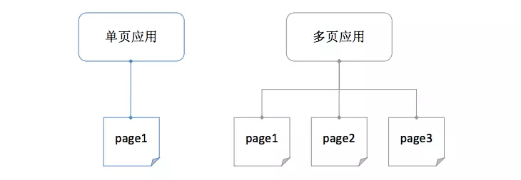

既然多页应用拥有多个 html，那么同样其应该拥有多个独立的入口文件、组件、路由、vuex 等。没错，说简单一点就是**多页应用的每个单页都可以拥有单页应用 src 目录下的文件及功能**，我们来看一下一个基础多页应用的目录结构：

```shell
├── node_modules               # 项目依赖包目录
├── build                      # 项目 webpack 功能目录
├── config                     # 项目配置项文件夹
├── src                        # 前端资源目录
│   ├── images                 # 图片目录
│   ├── components             # 公共组件目录
│   ├── pages                  # 页面目录
│   │   ├── page1              # page1 目录
│   │   │   ├── components     # page1 组件目录
│   │   │   ├── router         # page1 路由目录
│   │   │   ├── views          # page1 页面目录
│   │   │   ├── page1.html     # page1 html 模板
│   │   │   ├── page1.vue      # page1 vue 配置文件
│   │   │   └── page1.js       # page1 入口文件
│   │   ├── page2              # page2 目录
│   │   └── index              # index 目录
│   ├── common                 # 公共方法目录
│   └── store                  # 状态管理 store 目录
├── .gitignore                 # git 忽略文件
├── .env                       # 全局环境配置文件
├── .env.dev                   # 开发环境配置文件
├── .postcssrc.js              # postcss 配置文件
├── babel.config.js            # babel 配置文件
├── package.json               # 包管理文件
├── vue.config.js              # CLI 配置文件
└── yarn.lock                  # yarn 依赖信息文件
```

根据上方目录结构我们可以看出其实 pages 下的一个目录就是一个单页包含的功能，这里我们包含了 3 个目录就构成了多页应用。

除了目录结构的不同外，其实区别单页应用，多页应用在很多配置上都需要进行修改，比如单入口变为多入口、单模板变为多模板等，那么下面我们就来了解一下多页应用的具体实现。

## 多入口

在单页应用中，我们的入口文件只有一个，CLI 默认配置的是 main.js，但是到了多页应用，我们的入口文件便包含了 page1.js、page2.js、index.js等，数量取决于 pages 文件夹下目录的个数，这时候为了项目的可拓展性，我们需要自动计算入口文件的数量并解析路径配置到 webpack 中的 entry 属性上，如：

```
module.exports = {
    ...
    
    entry: {
        page1: '/xxx/pages/page1/page1.js',
        page2: '/xxx/pages/page2/page2.js',
        index: '/xxx/pages/index/index.js',
    },
    
    ...
}
```

那么我们如何读取并解析这样的路径呢，这里就需要使用工具和函数来解决了。我们可以在根目录新建 build 文件夹存放 utils.js 这样共用的 webpack 功能性文件，并加入多入口读取解析方法：

```javascript
/* utils.js */
const path = require('path');

// glob 是 webpack 安装时依赖的一个第三方模块，该模块允许你使用 * 等符号,
// 例如 lib/*.js 就是获取 lib 文件夹下的所有 js 后缀名的文件
const glob = require('glob');

// 取得相应的页面路径，因为之前的配置，所以是 src 文件夹下的 pages 文件夹
const PAGE_PATH = path.resolve(__dirname, '../src/pages');

/* 
* 多入口配置
* 通过 glob 模块读取 pages 文件夹下的所有对应文件夹下的 js * 后缀文件，如果该文件存在
* 那么就作为入口处理
*/
exports.getEntries = () => {
    let entryFiles = glob.sync(PAGE_PATH + '/*/*.js') // 同步读取所有入口文件
    let map = {}
    
    // 遍历所有入口文件
    entryFiles.forEach(filePath => {
        // 获取文件名
        let filename = filePath.substring(filePath.lastIndexOf('\/') + 1, filePath.lastIndexOf('.'))
        
        // 以键值对的形式存储
        map[filename] = filePath 
    })
    
    return map
}
```

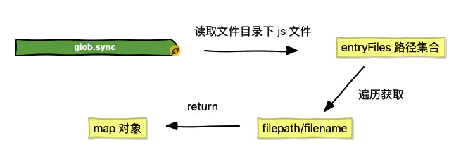

上方我们使用了 [glob](https://github.com/isaacs/node-glob) 这一第三方模块读取所有 pages 文件夹下的入口文件，其需要进行安装：`yarn add glob --dev`

读取并存储完毕后，我们得到了一个入口文件的对象集合，这个对象我们便可以将其设置到 webpack 的 entry 属性上，这里我们需要修改 vue.config.js 的配置来间接修改 webpack 的值：

```
/* vue.config.js */

const utils = require('./build/utils')

module.exports = {
    ...
    
    configureWebpack: config => {
        config.entry = utils.getEntries()
    },
    
    ...
}
```

这样我们多入口的设置便完成了，当然这并不是 CLI 所希望的操作，后面我们会进行改进。

## 多模板

相对于多入口来说，多模板的配置也是大同小异，这里所说的模板便是每个 page 下的 html 模板文件，而模板文件的作用主要用于 webpack 中 `html-webpack-plugin` 插件的配置，其会根据模板文件生产一个编译后的 html 文件并自动加入携带 hash 的脚本和样式，基本配置如下：

```javascript
/* webpack 配置文件 */
const HtmlWebpackPlugin = require('html-webpack-plugin') // 安装并引用插件

module.exports = {
    ...
    
    plugins: [
        new HtmlWebpackPlugin({
            title: 'My Page', // 生成 html 中的 title
            filename: 'demo.html', // 生成 html 的文件名
            template: 'xxx/xxx/demo.html', // 模板路径
            chunks: ['manifest', 'vendor', 'demo'], // 所要包含的模块
            inject: true, // 是否注入资源
        })
    ]
    
    ...
}
```

以上是单模板的配置，那么如果是多模板只要继续往 plugins 数组中添加 HtmlWebpackPlugin 即可，但是为了和多入口一样能够灵活的获取 pages 目录下所有模板文件并进行配置，我们可以在 utils.js 中添加多模板的读取解析方法：

```javascript
/* utils.js */

// 多页面输出配置
// 与上面的多页面入口配置相同，读取 page 文件夹下的对应的 html 后缀文件，然后放入数组中
exports.htmlPlugin = configs => {
    let entryHtml = glob.sync(PAGE_PATH + '/*/*.html')
    let arr = []
    
    entryHtml.forEach(filePath => {
        let filename = filePath.substring(filePath.lastIndexOf('\/') + 1, filePath.lastIndexOf('.'))
        let conf = {
            template: filePath, // 模板路径
            filename: filename + '.html', // 生成 html 的文件名
            chunks: ['manifest', 'vendor',  filename],
            inject: true,
        }
        
        // 如果有自定义配置可以进行 merge
        if (configs) {
            conf = merge(conf, configs)
        }
        
        // 针对生产环境配置
        if (process.env.NODE_ENV === 'production') {
            conf = merge(conf, {
                minify: {
                    removeComments: true, // 删除 html 中的注释代码
                    collapseWhitespace: true, // 删除 html 中的空白符
                    // removeAttributeQuotes: true // 删除 html 元素中属性的引号
                },
                chunksSortMode: 'manual' // 按 manual 的顺序引入
            })
        }
        
        arr.push(new HtmlWebpackPlugin(conf))
    })
    
    return arr
}
```

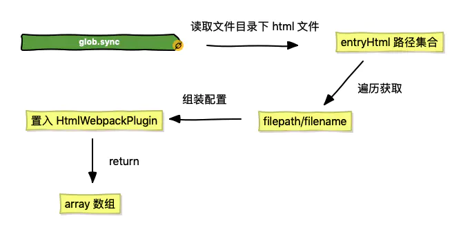

以上我们仍然是使用 glob 读取所有模板文件，然后将其遍历并设置每个模板的 config，同时针对一些自定义配置和生产环境的配置进行了 merge 处理，其中自定义配置的功能我会在下节进行介绍，这里介绍一下生产环境下 `minify` 配置的作用：**将 html-minifier 的选项作为对象来缩小输出**。

[html-minifier](https://github.com/kangax/html-minifier) 是一款用于缩小 html 文件大小的工具，其有很多配置项功能，包括上述所列举的常用的删除注释、空白、引号等。

当我们编写完了多模板的方法后，我们同样可以在 vue.config.js 中进行配置，与多入口不同的是我们在 configureWebpack 中不能直接替换 plugins 的值，因为它还包含了其他插件，这时候大家还记得第 3 节中讲到的使用 return 返回一个对象来进行 merge 操作吗？

```javascript
/* vue.config.js */

const utils = require('./build/utils')

module.exports = {
    ...
    
    configureWebpack: config => {
        config.entry = utils.getEntries() // 直接覆盖 entry 配置
        
        // 使用 return 一个对象会通过 webpack-merge 进行合并，plugins 不会置空
        return {
            plugins: [...utils.htmlPlugin()]
        }
    },
    
    ...
}
```

如此我们多页应用的多入口和多模板的配置就完成了，这时候我们运行命令 `yarn build` 后你会发现 dist 目录下生成了 3 个 html 文件，分别是 index.html、page1.html 和 page2.html。

## 使用 pages 配置

其实，在 vue.config.js 中，我们还有一个配置没有使用，便是 pages。pages 对象允许我们为应用配置多个入口及模板，这就为我们的多页应用提供了开放的配置入口。官方示例代码如下：

```javascript
/* vue.config.js */
module.exports = {
    pages: {
        index: {
            // page 的入口
            entry: 'src/index/main.js',
            // 模板来源
            template: 'public/index.html',
            // 在 dist/index.html 的输出
            filename: 'index.html',
            // 当使用 title 选项时，
            // template 中的 title 标签需要是 <title><%= htmlWebpackPlugin.options.title %></title>
            title: 'Index Page',
            // 在这个页面中包含的块，默认情况下会包含
            // 提取出来的通用 chunk 和 vendor chunk。
            chunks: ['chunk-vendors', 'chunk-common', 'index']
        },
        // 当使用只有入口的字符串格式时，
        // 模板会被推导为 `public/subpage.html`
        // 并且如果找不到的话，就回退到 `public/index.html`。
        // 输出文件名会被推导为 `subpage.html`。
        subpage: 'src/subpage/main.js'
    }
}
```

我们不难发现，pages 对象中的 key 就是入口的别名，而其 value 对象其实是入口 entry 和模板属性的合并，这样我们上述介绍的获取多入口和多模板的方法就可以合并成一个函数来进行多页的处理，合并后的 setPages 方法如下：

```javascript
// pages 多入口配置
exports.setPages = configs => {
    let entryFiles = glob.sync(PAGE_PATH + '/*/*.js')
    let map = {}

    entryFiles.forEach(filePath => {
        let filename = filePath.substring(filePath.lastIndexOf('\/') + 1, filePath.lastIndexOf('.'))
        let tmp = filePath.substring(0, filePath.lastIndexOf('\/'))

        let conf = {
            // page 的入口
            entry: filePath, 
            // 模板来源
            template: tmp + '.html', 
            // 在 dist/index.html 的输出
            filename: filename + '.html', 
            // 页面模板需要加对应的js脚本，如果不加这行则每个页面都会引入所有的js脚本
            chunks: ['manifest', 'vendor', filename], 
            inject: true,
        };

        if (configs) {
            conf = merge(conf, configs)
        }

        if (process.env.NODE_ENV === 'production') {
            conf = merge(conf, {
                minify: {
                    removeComments: true, // 删除 html 中的注释代码
                    collapseWhitespace: true, // 删除 html 中的空白符
                    // removeAttributeQuotes: true // 删除 html 元素中属性的引号
                },
                chunksSortMode: 'manual'// 按 manual 的顺序引入
            })
        }

        map[filename] = conf
    })

    return map
}
```

上述代码我们 return 出的 map 对象就是 pages 所需要的配置项结构，我们只需在 vue.config.js 中引用即可：

```javascript
/* vue.config.js */

const utils = require('./build/utils')

module.exports = {
    ...
    
    pages: utils.setPages(),
    
    ...
}
```

这样我们多页应用基于 pages 配置的改进就大功告成了，当你运行打包命令来查看输出结果的时候，你会发现和之前的方式相比并没有什么变化，这就说明这两种方式都适用于多页的构建，但是这里还是推荐大家使用更便捷的 pages 配置。

## 结语

本文主要讲解了多页应用开发中多入口和多模板的实现方式，通过针对 webpack 配置的修改我们基本了解了多页模式与单页模式的差异性，下篇文章我们将以本文内容为基础进一步完善我们的多页应用配置，使其能够正常适应实际的开发与生产。

本案例代码地址：[multi-page-project](https://github.com/luozhihao/vue-project-code/tree/master/multi-page-project)

## 思考 & 作业

- 多页应用相比单页应用有哪些优点和缺点？
- `chunksSortMode` 除了文中介绍的 `manual` 手动排序外，还有哪些排序方式？
- glob 中 `*` 和 `**` 的区别是什么？


# 构建实战篇 3：多页路由与模板解析

上篇文章中我们成功打包并输出了多页文件，而构建一个多页应用能够让我们进一步了解项目配置的可拓展性，可以对学习 Vue 和 webpack 起到强化训练的效果，本文将在此基础上主要针对多页路由及模板的配置进行系列的介绍。

## 路由配置

### 1. 跳转

在配置路由前，首先我们要明确一点就是，多页应用中的每个单页都是相互隔离的，即如果你想从 page1 下的路由跳到 page2 下的路由，你无法使用 vue-router 中的方法进行跳转，需要使用原生方法：`location.href` 或 `location.replace`。

此外为了能够清晰的分辨路由属于哪个单页，我们应该给每个单页路由添加前缀，比如：

- index 单页：/vue/
- page1 单页：/vue/page1/
- page2 单页：/vue/page2/

其中 /vue/ 为项目的二级目录，其后的目录代表路由属于哪个单页。因此我们每个单页的路由配置可以像这样：

```
/* page1 单页路由配置 */

import Vue from 'vue'
import Router from 'vue-router'

// 首页
const Home = (resolve => {
    require.ensure(['../views/home.vue'], () => {
        resolve(require('../views/home.vue'))
    })
})

Vue.use(Router)

let base = `${process.env.BASE_URL}` + 'page1'; // 添加单页前缀

export default new Router({
    mode: 'history',
    base: base,
    routes: [
        {
            path: '/',
            name: 'home',
            component: Home
        },
    ]
})
```

我们通过设置路由的 base 值来为每个单页添加路由前缀，如果是 index 单页我们无需拼接路由前缀，直接跳转至二级目录即可。

那么在单页间跳转的地方，我们可以这样写：

```
<template>
  <div id="app">
    <div id="nav">
      <a @click="goFn('')">Index</a> |
      <a @click="goFn('page1')">Page1</a> |
      <a @click="goFn('page2')">Page2</a> |
    </div>
    <router-view/>
  </div>
</template>

<script>
export default {
    methods: {
        goFn(name) {
            location.href = `${process.env.BASE_URL}` + name
        }
    }
}
</script>
```

但是为了保持和 Vue 路由跳转同样的风格，我可以对单页之间的跳转做一下封装，实现一个 `Navigator` 类，类的代码可以查看本文最后的示例，封装完成后我们可以将跳转方法修改为：

```
this.$openRouter({
    name: name, // 跳转地址
    query: {
        text: 'hello' // 可以进行参数传递
    },
})
```

使用上述 `$openRouter` 方法我们还需要一个前提条件，便是将其绑定到 Vue 的原型链上，我们在所有单页的入口文件中添加：

```
import { Navigator } from '../../common' // 引入 Navigator

Vue.prototype.$openRouter = Navigator.openRouter; // 添加至 Vue 原型链
```

至此我们已经能够成功模仿 vue-router 进行单页间的跳转，但是需要注意的是因为其本质使用的是 location 跳转，所以必然会产生浏览器的刷新与重载。

### 2. 重定向

当我们完成上述路由跳转的功能后，可以在本地服务器上来进行一下测试，你会发现 Index 首页可以正常打开，但是跳转 Page1、Page2 却仍然处于 Index 父组件下，这是因为浏览器认为你所要跳转的页面还是在 Index 根路由下，同时又没有匹配到 Index 单页中对应的路由。这时候我们服务器需要做一次重定向，将下方路由指向对应的 html 文件即可：

```
/vue/page1 -> /vue/page1.html
/vue/page2 -> /vue/page2.html
```

在 vue.config.js 中，我们需要对 devServer 进行配置，添加 `historyApiFallback` 配置项，该配置项主要用于解决 HTML5 History API 产生的问题，比如其 rewrites 选项用于重写路由：

```
/* vue.config.js */

let baseUrl = '/vue/';

module.exports = {
    ...
    
    devServer: {
        historyApiFallback: {
            rewrites: [
                { from: new RegExp(baseUrl + 'page1'), to: baseUrl + 'page1.html' },
                { from: new RegExp(baseUrl + 'page2'), to: baseUrl + 'page2.html' },
            ]
        }
    }
    
    ...
}
```

上方我们通过 rewrites 匹配正则表达式的方式将 `/vue/page1` 这样的路由替换为访问服务器下正确 html 文件的形式，如此不同单页间便可以进行正确跳转和访问了。最后需要注意的是如果你的应用发布到正式服务器上，你同样需要让服务器或者中间层作出合理解析，参考：[HTML5 History 模式 # 后端配置例子](https://router.vuejs.org/zh/guide/essentials/history-mode.html#%E5%90%8E%E7%AB%AF%E9%85%8D%E7%BD%AE%E4%BE%8B%E5%AD%90)

而更多关于 historyApiFallback 的信息可以访问：[connect-history-api-fallback](https://github.com/bripkens/connect-history-api-fallback)

## 模板配置

上篇文章我们已经介绍了关于多模板的读取和配置，在配置 html-webpack-plugin 的时候我们提到了自定义配置，这里我将结合模板渲染的功能来进行统一介绍。

### 1. 模板渲染

这里所说的模板渲染是在我们的 html 模板文件中使用 html-webpack-plugin 提供的 [default template](https://github.com/jaketrent/html-webpack-template/blob/86f285d5c790a6c15263f5cc50fd666d51f974fd/index.html) 语法进行模板编写，比如：

```
<!DOCTYPE html>
<html>
  <head>
    <meta charset="utf-8">
    <meta http-equiv="X-UA-Compatible" content="IE=edge">
    <meta name="viewport" content="width=device-width,initial-scale=1.0">
    <title>模板</title>
    <% for (var chunk in htmlWebpackPlugin.files.css) { %>
        <% if(htmlWebpackPlugin.files.css[chunk]) {%>
            <link href="<%= htmlWebpackPlugin.files.css[chunk] %>" rel="stylesheet" />
        <%}%>
    <% } %>
  </head>
  <body>
    <div id="app"></div>
    <!-- built files will be auto injected -->

    <% for (var chunk in htmlWebpackPlugin.files.js) { %>
        <% if(htmlWebpackPlugin.files.js[chunk]) {%>
            <script type="text/javascript" src="<%= htmlWebpackPlugin.files.js[chunk] %>"></script>
        <%}%>
    <% } %>
  </body>
</html>
```

以上我们使用模板语法手动获取并遍历 htmlWebpackPlugin 打包后的文件并生成到模板中，其中的 `htmlWebpackPlugin` 变量是模板提供的可访问变量，其有以下特定数据：

```
"htmlWebpackPlugin": {
    "files": {
        "css": [ "main.css" ],
        "js": [ "assets/head_bundle.js", "assets/main_bundle.js"],
        "chunks": {
            "head": {
                "entry": "assets/head_bundle.js",
                "css": [ "main.css" ]
            },
            "main": {
                "entry": "assets/main_bundle.js",
                "css": []
            },
        }
    }
}
```

我们通过 `htmlWebpackPlugin.files` 可以获取打包输出的 js 及 css 文件路径，包括入口文件路径等。

需要注意的是如果你在模板中编写了插入对应 js 及 css 的语法，你需要设置 `inject` 的值为 false 来关闭资源的自动注入：

```javascript
/* utils.js */
...

let conf = {
    entry: filePath, // page 的入口
    template: filePath, // 模板路径
    filename: filename + '.html', // 生成 html 的文件名
    chunks: ['manifest', 'vendor',  filename],
    inject: false, // 关闭资源自动注入
}

...
```

否则在页面会引入两次资源，如下图所示：

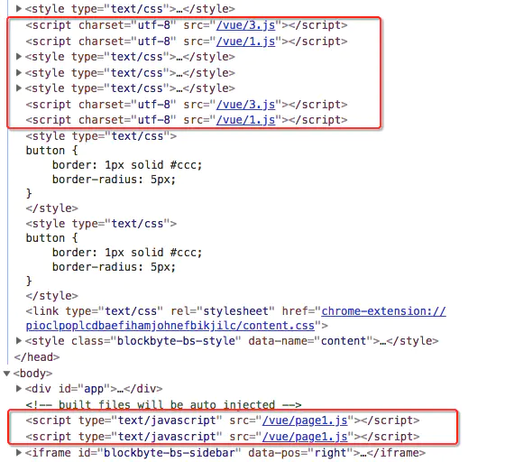

### 2. 自定义配置

在模板渲染中，我们只能够使用 htmlWebpackPlugin 内部的一些属性和方法来进行模板的定制化开发，那么如果遇到需要根据不同环境来引入不同资源，同时不同模板间的配置还可能不一样的需求情况的话，我们使用自定义配置会比较方便。比如我们需要在生产环境模板中引入第三方统计脚本：

```javascript
/* vue.config.js */

module.exports = {
    ...
    
    pages: utils.setPages({
        addScript() {
            if (process.env.NODE_ENV === 'production') {
                return `
                    <script src="https://s95.cnzz.com/z_stat.php?id=xxx&web_id=xxx" language="JavaScript"></script>
                `
            }

            return ''
        }
    }),
    
    ...
}
```

然后在页面模板中通过 `htmlWebpackPlugin.options` 获取自定义配置对象并进行输出：

```
<% if(htmlWebpackPlugin.options.addScript){ %>
    <%= htmlWebpackPlugin.options.addScript() %>
<%}%>
```

同时你也可以针对个别模板进行配置，比如我想只在 Index 单页中添加统计脚本，在 Page1 单页中添加其他脚本，那么你可以给 addScript 传入标识符来进行判断输出，比如：

```
<% if(htmlWebpackPlugin.options.addScript){ %>
    <%= htmlWebpackPlugin.options.addScript('index') %>
<%}%>
```

同时为 addScript 方法添加参数 from：

```javascript
addScript(from) {
    if (process.env.NODE_ENV === 'production') {
        let url = "https://xxx";
    
        if (from === 'index') {
            url = "https://s95.cnzz.com/z_stat.php?id=xxx&web_id=xxx";
        }
        
        return `
            <script src=${url} language="JavaScript"></script>
        `
    }

    return ''
}
```

这样我们就完成了自定义配置中的模板渲染功能。当然根据实际项目需求你的自定义配置项可能会更加复杂和灵活。

## 结语

通过 2 小节的学习，相信大家对 Vue 多页应用的构建已经有所了解。本文在第 1 节的基础上重点介绍了多页路由及模板的配置，阐述了其与单页应用的不同之处，同时针对模板自定义配置的使用场景给出了简单的实例，希望大家在了解的基础上将下方的实例代码作为参考，进行相应的实战。

本案例代码地址：[multi-page-project](https://github.com/luozhihao/vue-project-code/tree/master/multi-page-project)

## 思考 & 作业

- 多页应用中各自的 `Vuex Store` 信息能实现共享吗？
- html-webpack-plugin 如何解析非 .html 的模板，比如 .hbs，应该如何配置？


# 构建实战篇 4：项目整合与优化

前几小节，我们讲述了 Vue 项目构建的整体流程，从无到有的实现了单页和多页应用的功能配置，但在实现的过程中不乏一些可以整合的功能点及可行性的优化方案，就像大楼造完需要进行最后的项目验收改进一样，有待我们进一步的去完善。

## 使用 alias 简化路径

使用 webpack 构建过 Vue 项目的同学应该知道 `alias` 的作用，我们可以使用它将复杂的文件路径定义成一个变量来访问。在不使用 alias 的项目中，我们引入文件的时候通常会去计算被引入文件对于引入它的文件的相对路径，比如像这样：

```
import HelloWorld from '../../../../HelloWorld.vue'
```

一旦相对层次结构较深，我们就很难去定位所引入文件的具体位置，其实这并不是我们应该操心的地方，完全可以交给 webpack 来进行处理。在原生的 webpack 配置中我们可以定义 alias 来解决这一问题：

```
const path = require('path')

const resolve = dir => {
    return path.join(__dirname, dir)
}

module.exports = {
    ...
    
    resolve: {
        alias: {
            '@': resolve('src'), // 定义 src 目录变量
            _lib: resolve('src/common'), // 定义 common 目录变量,
            _com: resolve('src/components'), // 定义 components 目录变量,
            _img: resolve('src/images'), // 定义 images 目录变量,
            _ser: resolve('src/services'), // 定义 services 目录变量,
        }
    },
    
    ...
}
```

上方我们在 webpack resolve（解析）对象下配置 alias 的值，将常用的一些路径赋值给了我们自定义的变量，这样我们便可以将第一个例子简化为：

```
import HelloWorld from '_com/HelloWorld.vue'
```

而在 CLI 3.x 中我们无法直接操作 webpack 的配置文件，我们需要通过 chainWebpack 来进行间接修改，代码如下：

```
/* vue.config.js */
module.exports = {
    ...
    
    chainWebpack: config => {
        config.resolve.alias
            .set('@', resolve('src'))
            .set('_lib', resolve('src/common'))
            .set('_com', resolve('src/components'))
            .set('_img', resolve('src/images'))
            .set('_ser', resolve('src/services'))
    },
    
    ...
}
```

这样我们修改 webpack alias 来简化路径的优化就实现了。但是需要注意的是对于在样式及 html 模板中引用路径的简写时，前面需要加上 `～` 符，否则路径解析会失败，如：

```
.img {
    background: (~_img/home.png);
}
```

## 整合功能模块

在多页应用的构建中，由于存在多个入口文件，因此会出现重复书写相同入口配置的情况，这样对于后期的修改和维护都不是特别友好，需要修改所有入口文件的相同配置，比如在 index 单页的入口中我们引用了 VConsole 及 performance 的配置，同时在 Vue 实例上还添加了 $openRouter 方法：

```
import Vue from 'vue'
import App from './index.vue'
import router from './router'
import store from '@/store/'
import { Navigator } from '../../common'

// 如果是非线上环境，不加载 VConsole
if (process.env.NODE_ENV !== 'production') {
    var VConsole = require('vconsole/dist/vconsole.min.js');
    var vConsole = new VConsole();

    Vue.config.performance = true;
}

Vue.$openRouter = Vue.prototype.$openRouter = Navigator.openRouter;

new Vue({
  router,
  store,
  render: h => h(App)
}).$mount('#app')
```

而在 page1 和 page2 的入口文件中也同样进行了上述配置，那我们该如何整合这些重复代码，使其能够实现一次修改多处生效的功能呢？最简单的方法便是封装成一个共用方法来进行调用，这里我们可以在 common 文件夹下新建 entryConfig 文件夹用于放置入口文件中公共配置的封装，封装代码如下：

```
import { Navigator } from '../index'

export default (Vue) => {

    // 如果是非线上环境，不加载 VConsole
    if (process.env.NODE_ENV !== 'production') {
        var VConsole = require('vconsole/dist/vconsole.min.js');
        var vConsole = new VConsole();

        Vue.config.performance = true;
    }

    Vue.$openRouter = Vue.prototype.$openRouter = Navigator.openRouter;
}
```

上述代码我们向外暴露了一个函数，在调用它的入口文件中传入 Vue 实例作为参数即可实现内部功能的共用，我们可以将原本的入口文件简化为:

```
import Vue from 'vue'
import App from './index.vue'
import router from './router'
import store from '@/store/'
import entryConfig from '_lib/entryConfig/'

// 调用公共方法加载配置
entryConfig(Vue)

new Vue({
  router,
  store,
  render: h => h(App)
}).$mount('#app')
```

这样我们便完成了入口文件配置的整合，当然你还可以给该函数传入 router 实例及自定义参数用于其他共用配置的封装。

## 开启 Gzip 压缩

在《webpack 在 CLI 3 中的应用》章节，我们介绍了 CLI 为我们内置的 webpack plugins，使用这些内置插件基本已经能够满足我们大多数项目的构建和优化，当然你仍然可以为项目添加自己想要的插件来实现一些差异化的功能，比如使用 [compression-webpack-plugin](https://www.npmjs.com/package/compression-webpack-plugin) 来开启 Gzip 压缩。在 vue.config.js 配置文件中，我们通过 configureWebpack 中返回一个对象来实现 plugins 的合并：

```
/* vue.config.js */
const isPro = process.env.NODE_ENV === 'production'

module.exports = {
    ...
    
    configureWebpack: config => {
        if (isPro) {
            return {
                plugins: [
                    new CompressionWebpackPlugin({
                         // 目标文件名称。[path] 被替换为原始文件的路径和 [query] 查询
                        filename: '[path].gz[query]',
                        // 使用 gzip 压缩
                        algorithm: 'gzip', 
                        // 处理与此正则相匹配的所有文件
                        test: new RegExp(
                            '\\.(js|css)$'
                        ),
                        // 只处理大于此大小的文件
                        threshold: 10240,
                        // 最小压缩比达到 0.8 时才会被压缩
                        minRatio: 0.8，
                    })
                ]
            }
        }
    }
    ...
}
```

上方我们通过在生产环境中增加 Gzip 压缩配置实现了打包后输出增加对应的 .gz 为后缀的文件，而由于我们配置项中配置的是只压缩大小超过 10240B（10kB）的 JS 及 CSS，因此不满足条件的文件不会进行 Gzip 压缩。

Gzip 压缩能在普通压缩的基础上再进行 50% 以上 的压缩，我们可以直接来看下控制台的输出对比图：

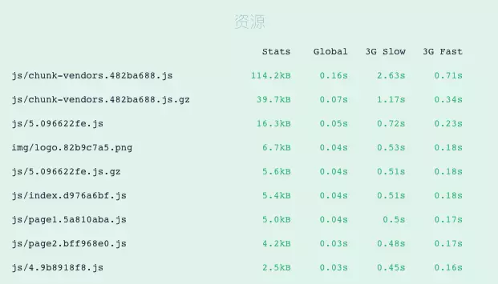

很明显，Gzip 压缩后的文件体积得到了很大程度的减小，这对于浏览器资源加载速度的提升起到了非常有效的帮助。但是需要注意的是访问 Gzip 压缩的文件需要服务端进行相应配置，以下是 Nginx Gzip 压缩的流程：

> Nginx 开启 Gzip 压缩配置后，其会根据配置情况对指定的类型文件进行压缩，主要针对 JS 与 CSS 。如果文件路径中存在与原文件同名（加了个 .gz），Nginx 会获取 gz 文件，如果找不到，会主动进行 Gzip 压缩。

## 结语

至此，一路走来，我们成功完成了本小册 Vue 项目构建部分的教程，从 CLI 3.x 的使用到项目内外部环境的配置，再到最后多页应用的拓展，我们循序渐进、由浅入深的讲解了 Vue 项目构建的主要知识点及详细流程，希望大家能够在此基础上举一反三，结合实际代码，将理论知识转化为实际运用，配合自己的理解，一步步实现自己的项目构建，并为构建出的项目添砖加瓦，实现质的飞跃。

## 思考 & 作业

- 除了本文中介绍的项目优化方法，还有哪些常见的优化手段？如何通过 Vue CLI 3 配置实现？
- 总结并对比 Vue CLI 2.x，Vue CLI 3.x 在项目构建方面有哪些优势和不足？