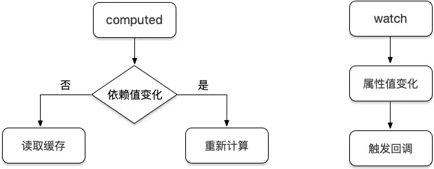
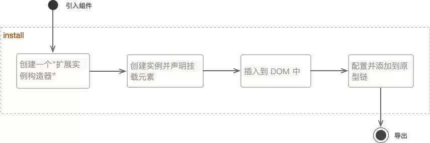
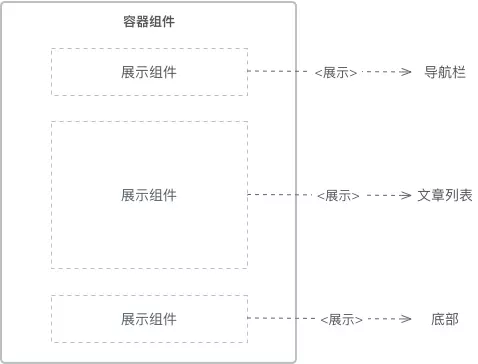
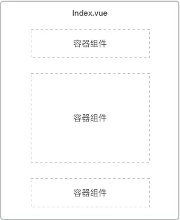
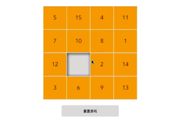
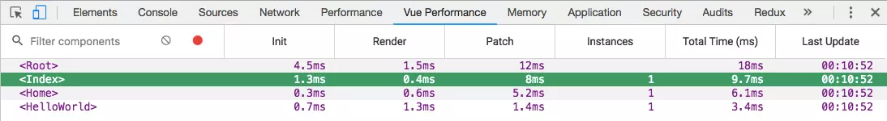

# 开发指南篇 1：从编码技巧与规范开始

当我们完成项目的构建，进入开发阶段的时候，除了你需要了解框架本身的知识点外，我们还需要提前掌握一些项目的编码技巧与规范，在根源上解决之后因编码缺陷而导致的项目维护困难、性能下降等常见问题，为项目多人开发提供编码的一致性。

本文将罗列项目中常用的一些编码技巧与规范来帮助大家提升代码质量，并会结合代码片段加强大家的理解与认知。当然不是所有实例都是针对 Vue.js 开发的，有些同样也适用于其他前端项目。

## 实例

### 1. 使用对象代替 if 及 switch

在很多情况下，我们经常会遇到循环判断执行赋值操作的场景，一般我们都会使用 if 及 switch 的条件判断，如果符合则执行赋值，不符合则进入下个判断，比如：

```
let name = 'lisi';
let age = 18;

if (name === 'zhangsan') {
    age = 21;
} else if (name === 'lisi') {
    age = 18;
} else if (name === 'wangwu') {
    age = 12;
}

// 或者
switch(name) {
    case 'zhangsan':
        age = 21;
        break
    case 'lisi':
        age = 18;
        break
    case 'wangwu':
        age = 12;
        break
}
```

这样的写法不仅冗余，而且代码执行效率不高，我们可以使用对象的形式简写：

```
let name = 'lisi';
let obj = {
    zhangsan: 21,
    lisi: 18,
    wangwu: 12
};

let age = obj[name] || 18;
```

以上这种技巧适用于循环判断一次赋值的情况，如果判断过后有较多处理逻辑的还需要使用 if 或 switch 等方法。

### 2. 使用 Array.from 快速生成数组

一般我们生成一个有规律的数组会使用循环插入的方法，比如使用时间选择插件时，我们可能需要将小时数存放在数组中：

```
let hours = [];

for (let i = 0; i < 24; i++) {
    hours.push(i + '时');
}
```

如果使用 Array.from 我们可以简写为：

```
let hours = Array.from({ length: 24 }, (value, index) => index + '时');
```

### 3. 使用 router.beforeEach 来处理跳转前逻辑

在某些情况下，我们需要在路由跳转前处理一些特定的业务逻辑，比如修改路由跳转、设置 title 等，代码如下：

```
import Vue from 'vue'
import Router from 'vue-router'

Vue.use(Router)

// 首页
const Home = (resolve => {
    require.ensure(['../views/home.vue'], () => {
        resolve(require('../views/home.vue'))
    })
})

let base = `${process.env.BASE_URL}`;

let router =  new Router({
    mode: 'history',
    base: base,
    routes: [
        {
            path: '/',
            name: 'home',
            component: Home,
            meta: { title: '首页' }
        },
    ]
})

router.beforeEach((to, from, next) => {
    let title = to.meta && to.meta.title;
    
    if (title) {
        document.title = title; // 设置页面 title
    }
    
    if (to.name === 'home') {
    
        // 拦截并跳转至 page2 单页，$openRouter 方法在第 5 节中封装
        Vue.$openRouter({
            name: 'page2'
        });
    }
    
    next();
})

export default router
```

注意最后需要调用 `next()` 方法执行路由跳转。

### 4. 使用 v-if 来优化页面加载

在 Vue 页面中，一些模块可能需要用户主动触发才会显示，比如弹框组件等这样的子组件，那么我们可以使用 `v-if` 来进行按需渲染，没必要一进页面就渲染所有模块。比如：

```
<template>
    <div @click="showModuleB = true"></div>
    <module-b v-if="isShowModuleB"></module-b>
</template>

<script>
import moduleB from 'components/moduleB'
export default {
    data() {
        return {
            isShowModuleB: false
        }  
    },
    components: {
        moduleB
    }
}
</script>
```

这样当 isShowModuleB 为 false 的时候便不会加载该模块下的代码，包括一些耗时的接口调用。当然 v-if 主要适用于代码量较多、用户点击不是很频繁的模块的显示隐藏，同时如果涉及到权限问题的代码都需要使用 v-if，而不是 v-show。

### 5. 路由跳转尽量使用 name 而不是 path

我们前期配置的路由路径后期难免会进行修改，如果我们页面跳转的地方全是使用的 `path`，那么我们需要修改所有涉及该 path 的页面，这样不利于项目的维护。而相对于 path，name 使用起来就方便多了，因为其具有唯一性，即使我们修改了 path，还可以使用原来的 `name` 值进行跳转。

```
this.$router.push({ 
    name: 'page1'
});

// 而不是
this.$router.push({ 
    path: 'page1'
});
```

### 6. 使用 key 来优化 v-for 循环

`v-for` 是 Vue 提供的基于源数据多次渲染元素或模板块的指令。正因为是数据驱动，所以在修改列表数据的时候，Vue 内部会根据 key 值去判断某个值是否被修改，其会重新渲染修改后的值，否则复用之前的元素。

这里如果数据中存在唯一表示 id，则推荐使用 id 作为 key，如果没有则可以使用数组的下标 index 作为 key。因为如果在数组中间插入值，其之后的 index 会发生改变，即使数据没变 Vue 也会进行重新渲染，所以最好的办法是使用数组中不会变化且唯一的那一项作为 key 值。例如：

```
<template>
    <ul>
        <li v-for="(item, index) in arr" :key="item.id">{{ item.data }}</li>
    </ul>
</template>

<script>
export default {
    data() {
        return {
            arr: [
                {
                    id: 1,
                    data: 'a'
                },
                {
                    id: 2,
                    data: 'b'
                },
                {
                    id: 3,
                    data: 'c'
                }
            ]
        }
    }
}
</script>
```

### 7. 使用 computed 代替 watch

很多时候页面会出现 `watch` 的滥用而导致一系列问题的产生，而通常更好的办法是使用 `computed` 属性，首先需要区别它们有什么区别：

- watch：当监测的属性变化时会自动执行对应的回调函数
- computed：计算的属性只有在它的相关依赖发生改变时才会重新求值

其实它们在功能上还是有所区别的，但是有时候可以实现同样的效果，而 computed 会更胜一筹，比如：

```javascript
<template>
    <div>
        <input type="text" v-model="firstName">
        <input type="text" v-model="lastName">
        <span>{{ fullName }}</span>
        <span>{{ fullName2 }}</span>
    </div>
</template>

<script>
export default {
    data() {
        reurn {
            firstName: '',
            lastName: '',
            fullName2: ''
        }
    },
    
    // 使用 computed
    computed: {
        fullName() {
            return this.firstName + ' ' + this.lastName
        }
    },
    
    // 使用 watch
    watch: {
        firstName: function(newVal, oldVal) {
            this.fullName2 = newVal + ' ' + this.lastName;
        },
        lastName: function(newVal, oldVal) {
            this.fullName2 = this.firstName + ' ' + newVal;
        },
    }
}
</script>
```

上方我们通过对比可以看到，在处理多数据联动的情况下，使用 computed 会更加合理一点。



computed 监测的是依赖值，依赖值不变的情况下其会直接读取缓存进行复用，变化的情况下才会重新计算；而 watch 监测的是属性值， 只要属性值发生变化，其都会触发执行回调函数来执行一系列操作。


computed 监测的是依赖值，依赖值不变的情况下其会直接读取缓存进行复用，变化的情况下才会重新计算；而 watch 监测的是属性值， 只要属性值发生变化，其都会触发执行回调函数来执行一系列操作。

### 8. 统一管理缓存变量

在项目中或多或少会使用浏览器缓存，比如 sessionStorage 和 localStorage，当一个项目中存在很多这样的缓存存取情况的时候就会变得难以维护和管理，因为其就像全局变量一样散落在项目的各个地方，这时候我们应该将这些变量统一管理起来，放到一个或多个文件中去，比如：

```
/* types.js */

export const USER_NAME = 'userName';
export const TOKEN = 'token';
```

在需要存取的时候，直接引用：

```
import { USER_NAME, TOKEN } from '../types.js'

sessionStorage[USER_NAME] = '张三';
localStorage[TOKEN] = 'xxx';
```

使用这种方法的好处在于一旦我们需要修改变量名，直接修改管理文件中的值即可，无需修改使用它的页面，同时这也可以避免命名冲突等问题的出现，这类似于 vuex 中 mutations 变量的管理。

### 9. 使用 setTimeout 代替 setInterval

一般情况下我们在项目里不建议使用 `setInterval`，因为其会存在代码的执行间隔比预期小以及 “丢帧” 的现象，原因在于其本身的实现逻辑。很多人会认为 setInterval 中第二个时间参数的作用是经过该毫秒数执行回调方法，其实不然，其真正的作用是**经过该毫秒数将回调方法放置到队列中去**，但是如果队列中存在正在执行的方法，其会等待之前的方法完毕再执行，如果存在还未执行的代码实例，其不会插入到队列中去，也就产生了 “丢帧”。

而 setTimeout 并不会出现这样的现象，因为每一次调用都会产生了一个新定时器，同时在前一个定时器代码执行完之前，不会向队列插入新的定时器代码。

```
// 该定时器实际会在 3s 后立即触发下一次回调
setInterval(() => {
    // 执行完这里的代码需要 2s
}, 1000);

// 使用 setTimeout 改写，4秒后触发下一次回调
let doSometing = () => {
    // 执行完这里的代码需要 2s
    
    setTimeout(doSometing, 1000);
}

doSometing();
```

延伸阅读：[对于“不用setInterval，用setTimeout”的理解](https://segmentfault.com/a/1190000011282175)

### 10. 不要使用 for in 循环来遍历数组

大家应该都知道 `for in` 循环是用于遍历对象的，但它可以用来遍历数组吗？答案是可以的，因为数组在某种意义上也是对象，但是如果用其遍历数组会存在一些隐患：其会遍历数组原型链上的属性。

```
let arr = [1, 2];

for (let key in arr) {
    console.log(arr[key]); // 会正常打印 1, 2
}

// 但是如果在 Array 原型链上添加一个方法
Array.prototype.test = function() {};

for (let key in arr) {
    console.log(arr[key]); // 此时会打印 1, 2, ƒ () {}
}
```

因为我们不能保证项目代码中不会对数组原型链进行操作，也不能保证引入的第三方库不对其进行操作，所以不要使用 for in 循环来遍历数组。

## 结语

本文罗列了 10 个项目开发中常见的编码技巧与规范，其实技巧和规范之间本身就是相辅相成的，所以没有分别进行罗列。当然实际的项目开发中存在着很多这样的例子需要大家自己去归纳和整理，比如使用 `name` 来命名你的组件等。如果你有不错的点子，也可以分享在下方的评论区域中供大家学习。

拓展阅读：[前端各类规范集合](https://github.com/ecomfe/spec)

## 思考 & 作业

- 可以使用哪些技巧来实现数组的循环遍历、去重等？
- 在 Vue 项目中如何使用 `ESLint` 来规范 JS 代码的编写？
- .vue 单文件组件中如何进行代码的格式化？


# 开发指南篇 2：学会编写可复用性模块

在生活中，重复的机械劳动会消耗我们的时间和精力，提高生产成本，降低工作效率。同样，在代码世界中，编写重复的代码会导致代码的冗余，页面性能的下降以及后期维护成本的增加。由此可见将重复的事情复用起来是提高生产效率、降低维护成本的不二之选。

在 Vue 项目中，每一个页面都可以看作是由大大小小的模块构成的，即便是一行代码、一个函数、一个组件都可以看作是一个个自由的模块。那么提高代码的复用性的关键便在于编写可复用的模块，也就是编写可复用的代码、函数和组件等。

## 一个简单的例子

```
let person = [];

for (let i = 0; i < data.obj.items.length; i++) {
    person.push({
        name: data.obj.items[i].name,
        age: data.obj.items[i].age
    });
}
```

不知道上方代码给你的第一印象是什么？总之给我的印象是糟糕的，因为出现了重复性的代码片段 `data.obj.items`，可能这样的代码在我们团队开发中随处可见，这也说明了重复编码现象其实无处不在。

面对自己编写的代码，我们应该保持一颗去重的心，发现重复的地方就相当于找到了可以复用的模块。在不复用的情况下，上述代码一旦需要修改变量 `items` 为 `lists`，那么我们就得修改 3 处地方，不知不觉就增加了维护成本。而到时候往往修改你代码的人并不是你自己，所以对自己好点，对他人也会好点。复用后的代码如下：

```
let person = [];
let values = data.obj.items;

for (let i = 0; i < values.length; i++) {
    person.push({
        name: values[i].name,
        age: values[i].age
    });
}
```

我们通过将 data.obj.items 的值赋值给变量 values 来实现了复用，此时修改 `items` 为 `lists` 的话我们只需修改一处地方即可，不管是维护成本还是代码可读性上，复用的优势都显而易见。

## 封装成一个函数

除了使用变量的赋值缓存使用来解决数据的重复读取外，我们在开发过程中重复性更多的也许是功能点的重复，比如：

```
<tempalte>
    <div>
        <input type="text" v-model="str1">
        <input type="text" v-model="str2">
        <div>{{ str1.slice(1).toUpperCase() }}</div>
        <div>{{ str2.slice(1).toUpperCase() }}</div>
    </div>
</template>
```

上述代码的重复功能点在于截取输入框中第二个字符开始到最后的值并把它们转化成大写字母，像这样很简单的操作虽然重复使用也不会出现太大的问题，但是如果是代码量较多的操作呢？重复书写相同功能的代码是一种不经过大脑思考的行为，我们需要对其进行优化，这里我们可以把功能点封装成一个函数：

```
export default {
    methods: {
        sliceUpperCase(val) {
            return val.slice(1).toUpperCase()
        }
    }
}
```

如此我们只要在用到该方法的地方调用即可，将值传入其中并返回新值。当然像在双花括号插值和 v-bind 表达式中重复的功能点我们可以封装成过滤器比较合适：

```
// 单文件组件注册过滤器
filters: {
    sliceUpperCase(val) {
        return val.slice(1).toUpperCase()
    }
}

// 全局注册过滤器
Vue.filter('sliceUpperCase', function (val) {
    return val.slice(1).toUpperCase()
})
```

然后在 html 中使用“管道”符进行过滤：

```
<div>{{ str1 | sliceUpperCase }}</div>
<div>{{ str2 | sliceUpperCase }}</div>
```

这样我们就把重复的功能性代码封装成了函数，而不管是过滤器还是正常的方法封装，其本质都是函数的封装。

## 封装成一个组件

相比较于函数的封装，规模更大一点的便是组件的封装，组件包含了模板、脚本以及样式的代码，在实际开发中组件的使用频率也是非常大的，我们项目中的每一个页面其实都可以看作是一个父组件，其可以包含很多子组件，子组件通过接收父组件的值来渲染页面，父组件通过响应子组件的回调来触发事件。

封装一个组件主要包含两种方式，一种是最常见的整体封装，用户通过改变数据源来呈现不同的页面状态，代码结构不可定制化。例如：

```
<div>
    <my-component data="我是父组件传入子组件的数据"></my-component>
</div>
```

另一种便是自定义封装，也就是插槽(slot)，我们可以开放一部分槽位给父组件，使其能够进行一定程度的定制化，例如：

```
<div>
    <my-component data="我是父组件传入子组件的数据">
        <template slot="customize">
            <span>这是定制化的数据</span>
        </template>
    </my-component>
</div>
```

在 myComponent 组件中我们便可以接收对应的 slot：

```
<div class="container">
    <span>{{ data }}</span>
    <slot name="customize"></slot>
<div>
```

这里我们通过定义 slot 标签的 name 值为 customize 来接收父组件在使用该组件时在 template 标签上定义的 slot="customize" 中的代码，不同父组件可以定制不同的 slot 代码来实现差异化的插槽。最终渲染出来的代码如下：

```
<div>
    <div class="container">
        <span>我是父组件传入子组件的数据</span>
        <span>这是定制化的数据</span>
    </div>
</div>
```

这样我们就完成了一个小型组件的封装，将共用代码封装到组件中去，页面需要引入的时候直接使用 import 并进行相应注册即可，当然你也可以进行全局的引入：

```
import myComponent from '../myComponent.vue'

// 全局
Vue.component('my-component', myComponent)
```

## 封装成一个插件

在某些情况下，我们封装的内容可能不需要使用者对其内部代码结构进行了解，其只需要熟悉我们提供出来的相应方法和 api 即可，这需要我们更系统性的将公用部分逻辑封装成插件，来为项目添加全局功能，比如常见的 loading 功能、弹框功能等。

Vue 提供给了我们一个 install 方法来编写插件，使用该方法中的第一个 Vue 构造器参数可以为项目添加全局方法、资源、选项等。比如我们可以给组件添加一个简单的全局调用方法来实现插件的编写：

```
/* toast.js */
import ToastComponent from './toast.vue' // 引入组件

let $vm

export default {    
    install(Vue, options) {
        
        // 判断实例是否存在
        if (!$vm) {            
            const ToastPlugin = Vue.extend(ToastComponent); // 创建一个“扩展实例构造器”
            
            // 创建 $vm 实例
            $vm = new ToastPlugin({                
                el: document.createElement('div')  // 声明挂载元素          
            });            
            
            document.body.appendChild($vm.$el); // 把 toast 组件的 DOM 添加到 body 里
        } 
        
        // 给 toast 设置自定义文案和时间
        let toast = (text, duration) => {
            $vm.text = text;
            $vm.duration = duration;
            
            // 在指定 duration 之后让 toast 消失
            setTimeout(() => {
                $vm.isShow = false;  
            }, $vm.duration);
        }
        
        // 判断 Vue.$toast 是否存在
        if (!Vue.$toast) {            
            Vue.$toast = toast;        
        }        
        
        Vue.prototype.$toast = Vue.$toast; // 全局添加 $toast 事件
    }
}
```




成功编写完插件的 JS 脚本后，我们在入口文件中需要通过 Vue.use() 来注册一下该插件：

```
import Toast from '@/widgets/toast/toast.js'

Vue.use(Toast); // 注册 Toast
```

最后我们在需要调用它的地方直接传入配置项使用即可，比如：

```
this.$toast('Hello World', 2000);
```

当然你也可以不使用 install 方法来编写插件，直接采用导出一个封装好的实例方法并将其挂载到 Vue 的原型链上来实现相同的功能。

更详细的编写插件和实例的方法可以参考我之前写的一篇文章：[Vue 插件编写与实战](https://mp.weixin.qq.com/s/Aqgh7Dkialhm9v8U0wBuqg)

## 结语

本文讲解了编写可复用性模块的常见方法，通过出现了重复代码 -> 封装成一个变量 -> 封装成一个函数 -> 封装成一个组件 -> 封装成一个插件，一步步将重复代码进行分析和复用。而与重复代码做斗争是一个持久性的过程，我们需要时刻保持一种“强迫症”的心态去整理复用项目中的重复代码，做好编码的严谨和自律。

## 思考 & 作业

- 在 Vue 中如何添加全局自定义指令？
- 在 vue 路由切换时如何全局隐藏某个插件？比如文中的 toast
- 如何实现一个表单验证插件？需要运用到哪些知识？


# 开发指南篇 3：合理划分容器组件与展示组件

上篇文章我们提到了组件的概念，组件是目前模块化、组件化开发模式中必不可少的单元形式，那么除了其概念和可复用性外，我们对它的职能划分了解多少呢？

本文将立足 Vue 组件的职能来谈谈我个人对于其划分的理解，唯有了解不同类型组件的职能才能编写出可维护、低耦合的前端代码。

## 组件的职能划分

如果要将 Vue 组件按照职能划分，我们可以将其分为两种类型：容器组件和展示组件。

容器组件和展示组件的概念来自于 `Redux` 文档，那么首先什么是容器组件呢？顾名思义，它是一个容器性质的组件，我们可以把它理解为最外层的父组件，也就是最顶层的组件，一般我们把它放置在 `views` 文件夹下，其功能主要用于做数据提取与实现公共逻辑，然后渲染对应的子组件。

另一类组件叫做展示组件，字面意思就是主要用于做展示的组件，其主要功能是负责接收从容器组件传输过来的数据并在页面上渲染，实现其内部独有的功能逻辑。

一个页面中容器组件与展示组件的关系如下图所示：



上图我们以博客首页为例，容器组件就是整个首页最外层的父组件，而展示组件就包含了导航栏、文章列表、底部等子组件，代码层面如下：

```
<template>
    <div>
        <navigation @count="countFn"></navigation>
        <article :list="articleList"></article>
        <foot></foot>
    </div>
</template>

<script>
    import { mapActions, mapGetters } from 'vuex';
    export default {
        mounted() {
            this.SET_BLOG_DATA(); // 调用接口获取数据
        },
        computed: {
            ...mapGetters(['articleList']), // 监听 state
        }
        methods: {
            ...mapActions(['SET_BLOG_DATA', 'SET_NAV_COUNT']),
            countFn(item) {
            
                // 调用接口存储导航点击次数并跳转，通过派发 action 的形式来发起 state 变化
                this.SET_NAV_COUNT({ type: item.type });
                
                this.$router.push({name: item.route});
            }
        }
    }
</script>
```

以上是首页容器组件中的主要代码，其主要做了两件事情：数据的传递和回调的处理，当然还可以包括处理一些该页面中不属于任何一个展示组件的方法，比如校验登录状态。在一个容器组件中可以包含多个展示组件，下面我们来看一下展示组件 `Navigation` 中的代码：

```
<template>
    <ul>
        <li 
            v-for="(item, index) in nav"
            :key="index"
            @click="goNav(item)"
            v-text="item.name"
        ></li>
    </ul>
</template>

<script>
    export default {
        data() {
            return {
                nav: [{
                    name: '首页',
                    route: 'index',
                    type: 'index'
                }, {
                    name: '文章',
                    route: 'article',
                    type: 'article' 
                }, {
                    name: '关于',
                    route: 'about',
                    type: 'about' 
                }]
            }
        },
        methods: {
            goNav(item) {
                this.$emit('count', item); // 触发回调
            }
        }
    }
</script>
```

`Navigation` 导航组件只负责自己内部的数据渲染和回调逻辑，对于存储每个导航的点击量及跳转逻辑来说，作为展示组件这并不是其所关心的，所以我们需要通过触发容器组件回调的方式来实现。再来看一下展示组件 `Article` 的代码：

```
<template>
    <ul>
        <li 
            v-for="(item, index) in list"
            :key="index"
            @click="goPage(item.id)"
            v-text="item.title"
        ></li>
    </ul>
</template>

<script>
    export default {
        props: {
        
            // 接收容器组件数据
            list: {
                default: [],
                type: Array
            }
        }
    }
</script>
```

展示组件 Article 中动态的数据通过 `props` 从父组件中获取，其内部只处理文章列表的渲染工作，这样很好的将 UI 层面和应用层面进行了分离，便于今后该组件的复用。

此外 `Foot` 组件为纯静态组件，其只负责内部数据的渲染，不接收外部的数据和回调方法，这里就不做介绍了。

从以上代码示例中我们不难发现容器组件和展示组件的主要区别和注意点：

|               | 展示组件                   | 容器组件                           |
| ------------- | -------------------------- | ---------------------------------- |
| 作用          | 描述如何展现（骨架、样式） | 描述如何运行（数据获取、状态更新） |
| 是否使用 Vuex | 否                         | 是                                 |
| 数据来源      | props                      | 监听 Vuex state                    |
| 数据修改      | 从 props 调用回调函数      | 向 Vuex 派发 actions               |


相比较如果上述的博客首页不做组件的划分，全部逻辑都放在一个组件中，那么必然会导致代码的臃肿和难以维护，而一旦划分了容器组件和展示组件，后期如果哪个页面同样需要展示文章列表，我们只需要传递不同的数据直接复用即可。

## 组件的层次结构

了解了组件职能的划分后，我们再来看一下组件的层次结构。关于组件的层次，一般页面中不宜嵌套超过 3 层的组件，因为超过 3 层后父子组件的通信就会变得相对困难，不利于项目的开发和维护。3 层结构的容器组件与展示组件的数据传递如下：


可见组件的层次越深数据传递的过程就会变得越复杂，当然这取决于你如何划分容器组件和展示组件，比如我们可以将上述博客首页换一种划分方式：



上图我们页面中存在 3 个容器组件，每个容器组件又可以包含各自的展示组件，这样一定程度上可以减少组件的层次嵌套深度。当然展示组件中也可以包含对应的容器组件来解决数据传输的问题：


这样展示组件 B 下面的容器组件 C 便可以不依赖于容器组件 A 的数据，其可以单独的进行数据获取和状态更新。

而对于那些你不知道应该划分为容器组件和展示组件的组件，比如一些耦合度较高的组件，那么你可以暂时归类到其他组件中，混用容器和展示，随着日后功能的逐渐清晰，我们再将其进行划分。

## 结语

本文主要介绍了容器组件和展示组件的概念和层次划分，在编码上，容器组件和展示组件各司其职，它们将容器和展示更好的分离，提高了组件的重用度，降低了功能上的耦合度，为高效、高质量的代码开发奠定了基础。

## 思考 & 作业

- 如果你了解 React，那么试想一下在 React 中展示组件与容器组件有哪些异同点？
- 如果需要你对掘金首页进行组件的划分，你会如何划分其结构和层次？
- 在子组件的 `props` 中，如何动态的设置默认值？


# 开发指南篇 4：数据驱动与拼图游戏

数据驱动是 Vue 框架的核心特性之一，也是 Vue 响应式原理的具体体现，相信大家对其应该深有体会，尤其是在操作数据来触发页面更新的时候。

为了让大家更加了解数据驱动的理念，并解决使用过程中可能出现的一系列问题，本文将结合比较常见和简单的 “拼图游戏” 来展示 Vue 数据驱动的魅力所在。

## 效果展示

首先我们先来看一下实现的 “拼图游戏” 的动态效果：



在不操作 `DOM` 的情况下实现以上功能其实需要我们对 Vue 数据驱动及数据可视化有一个非常清楚的认知，在操作数据的同时驱动可视化界面的还原。

## 关键代码

接下来我们来看一下实现该拼图游戏的功能点及关键代码：

### 游戏面板的构建

```
<!-- HTML 部分 -->
<ul class="puzzle-wrap">
    <li 
        :class="{'puzzle': true, 'puzzle-empty': !puzzle}" 
        v-for="(puzzle, index) in puzzles"
        :key="index"
        v-text="puzzle"
    ></li>
</ul>
// 数据部分
export default {
    data() {
        return {
            puzzles: Array.from({ length: 15 }, (value, index) => index + 1)
        }
    },
}
```

上方我们使用 `v-for` 循环构建了从 1 ～ 15 按顺序排列的方块格子，也就是拼图完成时候的顺序，但是拼图游戏一开始数字的顺序应该是无序的，也是随机打乱的，那么我们怎么实现呢？可以使用下方的随机排列函数：

```
function shuffle(arr) {
    let len = arr.length
    
    for (let i = 0; i < len - 1; i++) {
        let idx = Math.floor(Math.random() * (len - i))
        let temp = arr[idx]
        arr[idx] = arr[len - i - 1]
        arr[len - i - 1] = temp
    }
    
    return arr
}
```

该函数中我们使用 `Math.random()` 来返回 0 和 1 之间的伪随机数，可能为 0，但总是小于1，[0, 1)，而通过这一特性我们可以实现生成 n-m，包含 n 但不包含 m 的整数，具体步骤如下：

- 第一步算出 `m-n` 的值，假设等于 w
- 第二步 `Math.random() * w`
- 第三步 `Math.random() * w + n`
- 第四步 `Math.floor(Math.random() * w + n)`

在 `shuffle` 函数中 n 值永远是 0，而 w（即 len - i） 值随着循环 i 值的变大而不断减小。

> 在上面的算法里，我们每一次循环从前 len - i 个元素里随机一个位置，将这个元素和第 len - i 个元素进行交换，迭代直到 i = len - 1 为止。

这一便实现了数组的随机打乱。最后我们需要在数组末尾追加一个空值来显示唯一一个空白格子：

```
this.puzzles.push('');
```

### 交换方块位置

实现随机数字后，当我们点击方块，如果其上下左右存在为空的格子就需要将其进行交换，而由于是数据驱动界面，这里我们便需要交换两者在数组中的位置来实现：

```
export default {
    methods: {
        
        // 点击方块
        moveFn(index) {
            let puzzles = this.puzzles

            // 获取点击位置上下左右的值
            let leftNum = this.puzzles[index - 1],
                rightNum = this.puzzles[index + 1],
                topNum = this.puzzles[index - 4],
                bottomNum = this.puzzles[index + 4]

            // 和为空的位置交换数值
            if (leftNum === '' && index % 4) {
                this.setPuzzle(index, -1)
            } else if (rightNum === '' && 3 !== index % 4) {
                this.setPuzzle(index, 1)
            } else if (topNum === '') {
                this.setPuzzle(index, -4)
            } else if (bottomNum === '') {
                this.setPuzzle(index, 4)
            }
        },

        // 设置数组值
        setPuzzle(index, num) {
            let curNum = this.puzzles[index]
            
            this.$set(this.puzzles, index + num, curNum)
            this.$set(this.puzzles, index, '')
        },
    }
}
```

由于是 16 宫格的拼图，所以我们在点击获取位置的时候需要考虑边界情况，比如第 4 个格子为空，我们点击第 5 个格子不应该交换它们，因为在界面上第 4 个格子不在第 5 个格子的左侧，所以我们使用 `index % 4` 的方法来进行边界的判断，同时使用 Vue 提供的 `$set` 方法来将响应属性添加到数组上。

### 校验是否过关

最后我们需要校验游戏是否过关，我们只需要在最后一个格子为空时去进行校验即可：

```
if (this.puzzles[15] === '') {
    const newPuzzles = this.puzzles.slice(0, 15)
    const isPass = newPuzzles.every((e, i) => e === i + 1)

    if (isPass) {
        alert ('恭喜，闯关成功！')
    }
}
```

我们使用数组的 `every` 方法来简化代码的复杂度，当所有数字大小和对应的数组下标 + 1 相吻合时即会返回 `true`。

如此我们便完成了一个简单拼图游戏的功能。

## 盲点及误区

在实现拼图游戏后，有些同学可能会存在一些疑惑，比如：数组赋值为什么要用 $set 方法？数组随机打乱为什么不用 sort 排序呢？下面便来进行讲解：

### 为什么要用 $set 方法

大家应该都知道如果不用 `$set` 方法我们可以直接通过操作数组索引的形式对数组进行赋值，从而交换拼图的中两者的数据：

```
// 设置数组值
setPuzzle(index, num) {
    let curNum = this.puzzles[index]
    
    this.puzzles[index + num] = curNum
    this.puzzles[index] = ''
    
    // this.$set(this.puzzles, index + num, curNum)
    // this.$set(this.puzzles, index, '')
}
```

但是你会发现这样做数据是改变了，但是页面并没有因此重新渲染，这是为什么呢？其实 Vue 官方已经给出了明确的答案：

> 由于 JavaScript 的限制，Vue 不能检测以下变动的数组：
>
> - 当你利用索引直接设置一个项时，例如：vm.items[indexOfItem] = newValue
> - 当你修改数组的长度时，例如：vm.items.length = newLength

我们这里使用的便是第一种利用索引的方式，由于 Vue 检测不到数组变动，因此页面便无法重绘。同样 Vue 也不能检测对象属性的添加或删除，需要使用 `Vue.set(object, key, value)` 方法来实现。

其实还有一种比较取巧的方式便是强制重新渲染 Vue 实例来解决这一问题：

```
// 设置数组值
setPuzzle(index, num) {
    let curNum = this.puzzles[index]
    
    this.puzzles[index + num] = curNum
    this.puzzles[index] = ''
    
    this.$forceUpdate() // 迫使 Vue 实例重新渲染
    
    // this.$set(this.puzzles, index + num, curNum)
    // this.$set(this.puzzles, index, '')
}
```

上方我们使用了 Vue 提供的 `$forceUpdate` 方法迫使 Vue 实例重新渲染，这样改变的数据就会被更新的页面中去。但是最好不要这样操作，因为这会导致 Vue 重新遍历此对象所有的属性，一定程度上会影响页面的性能。

### 为什么不用 sort 排序

其实 sort 方法也能够实现数组的随机排序，代码如下：

```
let puzzleArr = Array.from({ length: 15 }, (value, index) => index + 1);

// 随机打乱数组
puzzleArr = puzzleArr.sort(() => {
    return Math.random() - 0.5
});
```

我们通过使用 `Math.random()` 的随机数减去 0.5 来返回一个大于、等于或小于 0 的数，sort 方法会根据接收到的值来对相互比较的数据进行升序或是降序排列。

但是由于 JavaScript 内置排序算法的缺陷性，使用 sort 排序的结果并不随机分布，经过大量的测试你会发现**越大的数字出现在越后面的概率越大**。

由于本文并非是一篇介绍 sort 排序的文章，关于论证其缺陷性的话题这里就不进行详细展开了，感兴趣的同学可以进一步进行探究。

## 结语

本文实例是基于我之前写的一篇关于利用 Vue.js 实现拼图游戏的文章上进行了改进和优化，希望通过这样一个小游戏来强化大家对于 Vue 数据驱动的理解。相比操作 DOM 元素，操作数据其实更加的便捷和快速，可以使用较少的代码来实现一些较为复杂的逻辑。

具体实例代码可以参考：[puzzle](https://github.com/luozhihao/vue-project-code/blob/ea7294370af888084be41c10c914b4fedbf3f400/ui-framework-project/src/views/demo/puzzle.vue)

## 思考 & 作业

- Vue 中监听数据变化的原理是什么？是通过何种方式实现的？
- 如何论证原生 JS 中 sort 排序后越大的数字出现在越后面的概率越大？
- 如何使用 `Math.random()` 生成 n-m，不包含 n 但包含 m 的整数？


# 开发指南篇 5：Vue API 盲点解析

在了解了一些实用的开发技巧和编码理念后，我们在项目的开发过程中难免也会遇到因为不熟悉 Vue API 而导致的技术问题，而往往就是这样的一些问题消耗了我们大量的开发时间，造成代码可读性下降、功能紊乱甚至 `bug` 量的增加，其根本原因还是自己对 Vue API 的 “**无知**”。

本文将介绍 Vue 项目开发中比较难以理解并可能被你忽视的 API，唯有知己知彼，才能百战不殆。

## API 解析

### 使用 performance 开启性能追踪

`performance API` 是 Vue 全局配置 API 中的一个，我们可以使用它来进行网页性能的追踪，我们可以在入口文件中添加：

```
if (process.env.NODE_ENV !== 'production') {
    Vue.config.performance = true;
}
```

来开启这一功能，该 API（2.2.0 新增）功能只适用于开发模式和支持 `performance.mark` API 的浏览器上，开启后我们可以下载 [Vue Performance Devtool](https://chrome.google.com/webstore/search/vue%20performance%20devtool) 这一 chrome 插件来看查看各个组件的加载情况，如图：



从中我们可以清晰的看到页面组件在每个阶段的耗时情况，而针对耗时比较久的组件，我们便可以对其进行相应优化。

而其在 Vue 源码中主要使用了 [window.performance](https://developer.mozilla.org/zh-CN/docs/Web/API/Performance) 来获取网页性能数据，其中包含了 `performance.mark` 和 `performance.measure`。

- performance.mark 主要用于创建标记
- performance.measure 主要用于记录两个标记的时间间隔

例如：

```
performance.mark('start'); // 创建 start 标记
performance.mark('end'); // 创建 end 标记

performance.measure('output', 'start', 'end'); // 计算两者时间间隔

performance.getEntriesByName('output'); // 获取标记，返回值是一个数组，包含了间隔时间数据
```

熟练的使用 performance 我们可以查看并分析网页的很多数据，为我们项目优化提供保障。除了上述介绍的两个方法，我们还可以使用 `performance.timing` 来计算页面各个阶段的加载情况，关于 performance.timing 的介绍可以查看我之前写的一篇文章：[利用 Navigation Timing 测量页面加载时间](https://www.cnblogs.com/luozhihao/p/4681564.html)

### 使用 errorHandler 来捕获异常

在浏览器异常捕获的方法上，我们熟知的一般有：`try ... catch` 和 `window.onerror`，这也是原生 JavaScript 提供给我们处理异常的方式。但是在 Vue 2.x 中如果你一如既往的想使用 window.onerror 来捕获异常，那么其实你是捕获不到的，因为异常信息被框架自身的异常机制捕获了，你可以使用 `errorHandler` 来进行异常信息的获取：

```
Vue.config.errorHandler = function (err, vm, info) {
    let { 
        message, // 异常信息
        name, // 异常名称
        stack  // 异常堆栈信息
    } = err;

    // vm 为抛出异常的 Vue 实例
    // info 为 Vue 特定的错误信息，比如错误所在的生命周期钩子
}
```

在入口文件中加入上述代码后，我们便可以捕获到 Vue 项目中的一些异常信息了，但是需要注意的是 Vue 2.4.0 起的版本才支持捕获 Vue 自定义事件处理函数内部的错误，比如:

```
<template>
    <my-component @eventFn="doSomething"></my-component>
</template>

<script>
export default {
    methods: {
        doSomething() {
            console.log(a); // a is not defined
        }
    }
}
</script>
```

使用 Vue 中的异常捕获机制，我们可以针对捕获到的数据进行分析和上报，为实现前端异常监控奠定基础。关于对异常捕获的详细介绍，感兴趣的同学可以查看我的这篇文章：[谈谈前端异常捕获与上报](https://www.cnblogs.com/luozhihao/p/8635507.html)

### 使用 nextTick 将回调延迟到下次 DOM 更新循环之后执行

在某些情况下，我们改变页面中绑定的数据后需要对新视图进行一些操作，而这时候新视图其实还未生成，需要等待 DOM 的更新后才能获取的到，在这种场景下我们便可以使用 nextTick 来延迟回调的执行。比如未使用 `nextTick` 时的代码：

```javascript
<template>
    <ul ref="box">
        <li v-for="(item, index) in arr" :key="index"></li>
    </ul>
</template>

<script>
export default {
    data() {
        return {
            arr: []
        }
    },
    mounted() {
    	this.getData();
    },
    methods: {
        getData() {
            this.arr = [1, 2, 3];
            this.$refs.box.getElementsByTagName('li')[0].innerHTML = 'hello';
        }
    }
}
</script>
```

上方代码我们在实际运行的时候肯定会报错，因为我们获取 DOM 元素 li 的时候其还未被渲染，我们将方法放入 nextTick 回调中即可解决该问题：

```
this.$nextTick(() => {
    this.$refs.box.getElementsByTagName('li')[0].innerHTML = 'hello';
})
```

当然你也可以使用 ES6 的 `async/await` 语法来改写上述方法：

```
methods: {
    async getData() {
        this.arr = [1, 2, 3];
        
        await this.$nextTick();
        
        this.$refs.box.getElementsByTagName('li')[0].innerHTML = 'hello';
    }
}
```

那么接下来我们来分析下 Vue 是如何做到的，其源码中使用了 3 种方式：

- promise.then 延迟调用
- setTimeout(func, 0) 延迟功能
- MutationObserver 监听变化

前两种方式相信大家都比较熟悉，其都具备延迟执行的功能，我们也可以直接替换 nextTick 为这两种方式中的一种，同样可以解决问题。这里主要介绍下 [MutationObserver](https://developer.mozilla.org/zh-CN/docs/Web/API/MutationObserver) 这一 HTML5 新特性，那么什么是 `MutationObserver` 呢？用一句话介绍就是：我们可以使用它创建一个观察者对象，其会监听某个 DOM 元素，并在它的 DOM 树发生变化时执行我们提供的回调函数。实例化代码及配置如下：

```javascript
// 传入回调函数进行实例化
var observer = new MutationObserver(mutations => {
    mutations.forEach(mutation => {
        console.log(mutation.type);
    })
});

// 选择目标节点
var target = document.querySelector('#box');
 
// 配置观察选项
var config = { 
    attributes: true, // 是否观察属性的变动
    childList: true, // 是否观察子节点的变动（指新增，删除或者更改）
    characterData: true // 是否观察节点内容或节点文本的变动
};
 
// 传入目标节点和观察选项
observer.observe(target, config);
 
// 停止观察
observer.disconnect();
```

这样我们便可以观察 id 为 box 下的 DOM 树变化，一旦发生变化就会触发相应的回调方法，实现延迟调用的功能。

### 使用 watch 的深度遍历和立即调用功能

相信很多同学使用 `watch` 来监听数据变化的时候通常只使用过其中的 `handler` 回调，其实其还有两个参数，便是：

- deep 设置为 true 用于监听对象内部值的变化
- immediate 设置为 true 将立即以表达式的当前值触发回调

我们来看下代码中的配置：

```javascript
<template>
    <button @click="obj.a = 2">修改</button>
</template>
<script>
export default {
    data() {
        return {
            obj: {
                a: 1,
            }
        }
    },
    watch: {
        obj: {
            handler: function(newVal, oldVal) {
                console.log(newVal); 
            },
            deep: true,
            immediate: true
        }
    }
}
</script>
```

以上代码我们修改了 obj 对象中 a 属性的值，我们可以触发其 watch 中的 handler 回调输出新的对象，而如果不加 `deep: true`，我们只能监听 obj 的改变，并不会触发回调。同时我们也添加了 `immediate: true` 配置，其会立即以 obj 的当前值触发回调。

在 Vue 源码中，主要使用了 [Object.defineProperty (obj, key, option)](https://developer.mozilla.org/zh-CN/docs/Web/JavaScript/Reference/Global_Objects/Object/defineProperty) 方法来实现数据的监听，同时其也是 Vue 数据双向绑定的关键方法之一。示例代码如下：

```javascript
function Observer() {
    var result = null;
    
    Object.defineProperty(this, 'result', {
        get: function() {
            console.log('你访问了 result');
            return result;
        },
        set: function(value) {
            result = value;
            console.log('你设置了 result = ' + value);
        }
    });
}

var app = new Observer(); // 实例化

app.result; // 你访问了 result
app.result = 11; // 你设置了 result = 11
```

我们通过实例化了 `Observer` 方法来实现了一个简单的监听数据访问与变化的功能。`Object.defineProperty` 是 ES5 的语法，这也就是为什么 Vue 不支持 IE8 以及更低版本浏览器的主要原因。

### 对低开销的静态组件使用 v-once

Vue 提供了 `v-once` 指令用于只渲染元素和组件一次，一般可以用于存在大量静态数据组件的更新性能优化，注意是大量静态数据，因为少数情况下我们的页面渲染会因为一些静态数据而变慢。如果你需要对一个组件使用 v-once，可以直接在组件上绑定：

```
<my-component v-once :data="msg"></my-component>
```

这时候因为组件绑定了 v-once，所以无论 msg 的值如何变化，组件内渲染的永远是其第一次获取到的初始值。因此我们在使用 v-once 的时候需要考虑该组件今后的更新情况，避免不必要的问题产生。

### 使用 $isServer 判断当前实例是否运行于服务器

当我们的 Vue 项目中存在服务端渲染（SSR）的时候，有些项目文件可能会同时在客户端和服务端加载，这时候代码中的一些客户端浏览器才支持的属性或变量在服务端便会加载出错，比如 window、 document 等，这时候我们需要进行环境的判断来区分客户端和服务端，如果你不知道 `$isServer`，那么你可能会使用 `try ... catch` 或者 `process.env.VUE_ENV` 来判断：

```
try {
    document.title = 'test';
} catch(e) {}

// process.env.VUE_ENV 需要在 webpack 中进行配置
if (process.env.VUE_ENV === 'client') {
    document.title = 'test';
}
```

而使用 $isServer 则无需进行配置，在组件中直接使用该 API 即可：

```
if (this.$isServer) {
    document.title = 'test';
}
```

其源码中使用了 `Object.defineProperty` 来进行数据监测：

```javascript
Object.defineProperty(Vue.prototype, '$isServer', {
    get: isServerRendering
});

var _isServer;
var isServerRendering = function () {
    if (_isServer === undefined) {
        if (!inBrowser && !inWeex && typeof global !== 'undefined') {
            _isServer = global['process'].env.VUE_ENV === 'server';
        } else {
            _isServer = false;
        }
    }
    return _isServer
};
```

当我们访问 $isServer 属性时，其会调用 `isServerRendering` 方法，该方法会首先判断当前环境，如果在浏览器或者 Weex 下则返回 false，否则继续判断当前全局环境下的 `process.env.VUE_ENV` 是否为 server 来返回最终结果。

## 结语

每一门语言、一个框架都有其 API 文档，在 Vue 的项目开发过程中，很多时候当你一筹莫展之际，你可以尝试浏览一下 Vue 的 API 列表，或许你就会柳暗花明。

## 思考 & 作业

- 使用 watch 监听某一值时，同时修改该值两次会触发几次 watch 回调？
- 使用 `errorHandler` 捕获异常堆栈后如何解析 `source-map` 信息？
- 除了本文介绍的 Vue 盲点外，还有哪些需要注意并容易忽略的 API？