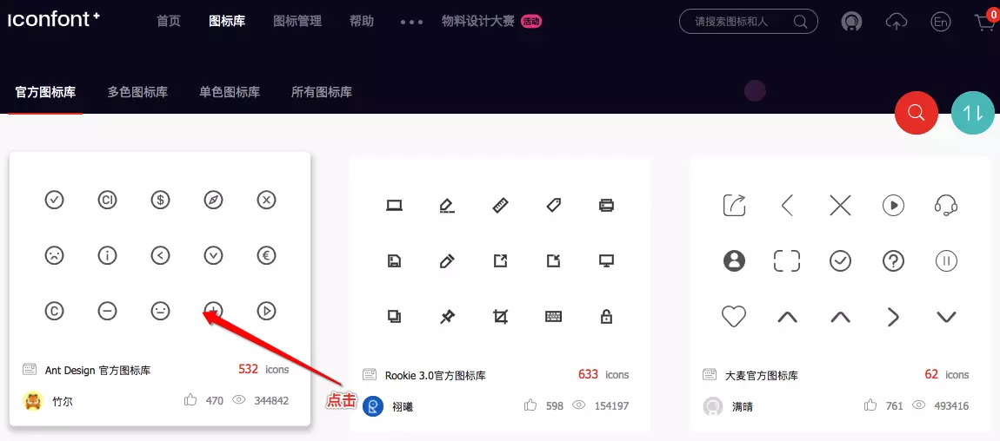

# 开发拓展篇 1：扩充你的开发工具

在项目开发中，工具的使用起到了至关重要的作用，正所谓工欲善其事，必先利其器，掌握一些实用的开发工具能够使我们的开发效率事半功倍。

那么我们应该掌握哪些开发工具的使用方法呢？其实一路走来，我们已经介绍的开发工具包括了 `npm`、`yarn`、`webpack` 以及一些集成在项目中的工具包，这些工具一定程度上都大大简化了我们的开发流程，起到了项目助推剂的作用。因此在开发工具的学习上我们应该抱着宜多不宜少的心态，积极主动的扩充自己的工具库。

## 巧用 Chrome 插件

首先，既然说到工具，那我们不得不介绍下占据浏览器市场份额霸主地位的 `Chrome` 了。相信每一个从事前端开发的同学都对其寄存着一种亲切感，因为只要是参与 web 项目的开发就基本上离不开它的关照，比如它提供的调试控制台以及数以万计的插件等。

而作为一名前端开发人员，我想你的 Chrome 浏览器地址栏右侧肯定排列着几款你钟爱的插件，使用的插件数量越多说明了你掌握的 Chrome 技能越多，同时一定程度上也凸显了你的开发能力。

那么接下来我们不妨来认识一下几款实用的 Chrome 插件：

### Vue.js devtools

首先介绍的肯定是 [Vue.js devtools](https://chrome.google.com/webstore/detail/vuejs-devtools/nhdogjmejiglipccpnnnanhbledajbpd?hl=zh-CN)，它是 Vue 官方发布的一款调试 Vue 项目的插件，支持数据模拟与调试。相信从事过 Vue 项目开发的同学都已经把它收入在自己的工具库中了，它的界面如下：


成功安装它之后，在 Vue 项目的页面中我们可以打开 Chrome 控制台选择 Vue 的 tab 进行页面调试。

### Vue Performance Devtool

在《Vue API 盲点解析》章节我们已经介绍了 [Vue Performance Devtool](https://chrome.google.com/webstore/detail/vue-performance-devtool/koljilikekcjfeecjefimopfffhkjbne) 这款插件，它可以分析我们页面中各个组件的性能情况，从而在其基础上我们可以有针对性的对组件的代码进行优化，如下图所示：


同样安装完毕后，我们可以打开 Chrome 控制台选择 `Vue Performance` 的 tab 进行组件的性能观察。

### Postman

[Postman](https://chrome.google.com/webstore/detail/postman/fhbjgbiflinjbdggehcddcbncdddomop?hl=en) 相信大家都比较熟悉，它是一款非常好用的接口调试工具。在 Vue 项目开发中，我们或多或少需要对后台提供的接口进行测试，比如传递数据并查看返回结果等，这时候使用 Postman 便可以完成这些任务。


Postman 会当作 Chrome 应用程序安装到你的电脑上，打开后我们可以选择请求方式（GET／POST），输入请求 URL 以及设置传递参数来进行接口的调用。

### Web Developer

[Web Developer](https://chrome.google.com/webstore/detail/web-developer/bfbameneiokkgbdmiekhjnmfkcnldhhm) 是一款强大的用于操作网页中各项资源与浏览器的插件，比如一键禁用 JS、编辑 CSS、清除 Cookie 等。


虽然说一些功能我们也可以在 Chrome 控制台实现，但其提供的快捷键能够十分方便的让我们在页面中操作某些资源。

### Google PageSpeed Insights API Extension

PageSpeed Insights (PSI) 是 `Google` 在全球范围内应用最广的开发者工具之一，其中文网页版 [developers.google.cn/speed/pages…](https://juejin.im/book/5b23a5aef265da59716fda09/section/developers.google.cn/speed/pagespeed/insights/) 也已经发布。作为一款专注于改进网页性能的开发者工具，它主要具有以下两个优势：**真实的网页运行速度** 及 **优化建议**。


为了便于使用，我们可以直接下载 Chrome 插件 [Google PageSpeed Insights API Extension](https://chrome.google.com/webstore/detail/google-pagespeed-insights/hfebkooaidmeboeblkkejdoepilnnjhn) 来对当前访问网址进行测试和分析。

### FeHelper

[FeHelper](https://juejin.im/book/5b23a5aef265da59716fda09/section/5b71b565f265da283a7e99da) 是百度 FE 团队开发的一款前端工具集插件，包含代码压缩／性能检测／字符串编解码等功能，能够帮助我们完成一些琐碎的开发任务。


FeHelper 为我们提供了十多种快捷功能，在需要的时候我们直接点击插件图标选择对应功能即可，操作起来十分便捷。

### Can I Use

[Can I Use](https://chrome.google.com/webstore/detail/can-i-use/decehbilpgknnlnkbgkcggjbgjbphljb) 是 [caniuse.com/](https://caniuse.com/) 网页版的插件。我们可以使用其来查看某一特性的浏览器支持程度，确保主流浏览器的支持。


使用 Chrome 插件形式的 Can I Use 我们可以快捷的查看项目中用到的某一特性的浏览器支持范围，同时还可以查看支持程度和兼容方式。

### 其他实用插件

- [JSONView](https://chrome.google.com/webstore/detail/jsonview/chklaanhfefbnpoihckbnefhakgolnmc) ：一款可以将后台返回的 JSON 字符串数据自动格式化成规范 JSON 格式的插件
- [WhatFont](https://chrome.google.com/webstore/detail/whatfont/jabopobgcpjmedljpbcaablpmlmfcogm)：一款可以显示浏览器中选择文字的字体类型／字号／颜色的插件
- [The QR Code Extension](https://chrome.google.com/webstore/detail/the-qr-code-extension/oijdcdmnjjgnnhgljmhkjlablaejfeeb)：一款允许当前页面生成二维码，并使用网络摄像头扫描二维码的插件
- [Test IE](https://chrome.google.com/webstore/detail/test-ie/eldlkpeoddgbmpjlnpfblfpgodnojfjl?hl=zh-CN)：一款可以模拟 `IE` 及其他主流浏览器的插件，但大部分模拟场景需要付费才能使用
- [Wappalyzer](https://chrome.google.com/webstore/detail/wappalyzer/gppongmhjkpfnbhagpmjfkannfbllamg)：一款查看当前网站使用的前后端技术的插件，帮助你学习和认识优秀网站的技术选型
- [Mobile/Responsive Web Design Tester](https://chrome.google.com/webstore/detail/mobileresponsive-web-desi/elmekokodcohlommfikpmojheggnbelo)：一款用于测试页面在不同机型下呈现的插件
- [Resolution Test](https://chrome.google.com/webstore/detail/resolution-test/idhfcdbheobinplaamokffboaccidbal)：一款用于测试页面在不同分辨率下呈现的插件

以上我们介绍了一些非常实用的 chrome 拓展插件来助力我们的前端开发，为项目开发提供了工具解决方案，同时也有助于帮助大家开启以工具为向导的开发模式。

## 分析你的包文件

每当我们使用 webpack 打包项目代码的时候，你可能需要关注一下打包生成的每个 js 文件的大小以及其包含的内容，这对于优化项目打包速度和提升页面加载性能都有十分大的帮助。

这里我们推荐使用 [webpack-bundle-analyzer](https://www.npmjs.com/package/webpack-bundle-analyzer) 这一款 webpack 插件来进行包文件的分析，下面我们就来介绍下其配置和使用方法。

首先作为一款需要内置在代码中的开发分析工具，我们需要安装并在 webpack 的 plugins 中添加该插件：

```
#  安装命令
yarn add webpack-bundle-analyzer --dev
/* vue.config.js */
const BundleAnalyzerPlugin = require('webpack-bundle-analyzer').BundleAnalyzerPlugin

const isPro = process.env.NODE_ENV === 'production'

module.exports = {
    
    ... 
    
    configureWebpack: config => {
        if (isPro) {
            return {
                plugins: [
                
                    // 使用包分析工具
                    new BundleAnalyzerPlugin()
                ]
            }
        }
    },
    
    ...
}
```

这样我们在生产环境下打包便可以在浏览器 8888 端口（默认）下打开页面进行包文件的分析，如下图所示：


图中区域内包含了我们打包出的所有 js 文件，我们可以以不同的颜色进行区分，同时我们也可以点击某一区块进行放大观察，以此来分析是否存在较大或重复的模块。而在页面左侧存在一个筛选面板，在该面板中我们能勾选需要查看的文件来进行显示，同时也可以切换查看原始、普通及 `GZIP` 压缩模式下的文件大小。

使用好 webpack-bundle-analyzer 工具我们可以快速的找到需要合并的模块，解决文件冗余，为资源优化提供可行性方案。

## 调试移动端页面

除了 Chrome 插件及打包分析工具的介绍外，我们再来了解下移动端页面的调试工具。相比 PC 端调试，移动端调试可能稍微复杂一点，但是只要熟练的使用好 “工具” 这一东西，我们同样可以在移动端的世界中游刃有余。

作为一名 `Mac` 及 `iOS` 用户，这里我主要介绍在 `iPhone` 手机中调试页面的方法，当然最后也会简单介绍一下 `Android` 手机页面的调试方法。

首先我们得具备这些工具：iPhone 手机一部、数据线一条、Mac 电脑一台。在满足以上要求后我们需要把手机通过数据线连接上 Mac 电脑，连接完毕后便可以进行如下步骤的设置：

#### 1. 打开苹果手机的 `Web 检查器` （设置 > Safari浏览器 > 高级 > Web检查器），一般情况下默认是开启的

#### 2. 打开 Mac 上的 `Safari` 的 `“开发”菜单`，一般情况下默认是开启的


#### 3. 在手机 Safari 浏览器中打开你需要调试的页面

#### 4. 在 Mac Safari 浏览器中选择你需要调试的页面（开发 > 你的 iPhone > 你的页面地址）

#### 5. 点击地址后弹出如图所示的控制台，你便可以在该控制台中进行调试了


最后你可以针对你的移动端页面进行断点调试、操作缓存、查看网络及资源等，帮助你快速的定位和解决问题。

而在 Android 手机中，我们同样可以对移动端页面进行调试，主要不同点在于 IOS 使用的工具是 iPhone 和 Mac，Android 使用的工具主要是 Android 手机和 Windows 系统罢了（Mac 也可以使用模拟器），当然还需要借助 Chrome 的帮助。

这里主要介绍一下 Chrome 中的 `inspect`，我们可以在 Chrome 地址栏输入：`chrome://inspect/` 来捕获手机访问的页面地址，前提是你的 Android 手机通过数据线连接上了电脑并开启了相应权限，最后获取到的地址会在 `Remote Target` 中显示：


点击相应的地址会弹出一个控制台，你可以在该控制台中进行页面的调试。

## 结语

本文介绍了 Vue 项目开发时常用的 Chrome 插件、包分析工具以及移动端调试工具，这些开发工具的使用能够帮助我们快速的定位项目中出现的一些疑难杂症，而唯有 “用正确的工具，做正确的事情” 才能有效的彰显工具对于项目开发和维护的重要性，使我们的工具库能够发挥它真正的价值。

## 思考 & 作业

- `webpack-bundle-analyzer` 有哪些配置项？分别有什么作用？
- 除了本文介绍的开发工具外，还有哪些比较实用的开发工具？


# 开发拓展篇 2：将 UI 界面交给第三方库

当你了解了 Vue 项目构建和开发的基本知识后，我认为接下来你一定想亲自在构建出的项目中填充自己的业务和功能逻辑，因为目前其还是空白的。

但是这里我不会教你如何实现一个具体的业务和功能模块，因为每个人想要实现的东西都可能不尽相同。如果你想快速开发一款应用，并且不想过多的操心页面 `UI` 层次的内容，比如你不想去实现一个下拉 UI 组件或设计一个 `icon` 图标，那么我想你有必要了解下 UI 库及图标库的应用。

## UI 库

UI 库是脱离 JS 框架外的一种 “工具”，相比 JS 框架可以帮助你实现各种业务逻辑，其更关注于页面 UI 层面的实现，比如提供和业务无关的弹窗、导航、表单组件等，为项目 UI 层面的功能提供解决方案，比如 [jQuery UI](https://jqueryui.com/)。

而由于本小册介绍的 JS 框架是 Vue，所以在 Vue 项目中我们需要使用基于 Vue 开发的 UI 库。本文将以比较流行的 [Vux](https://doc.vux.li/zh-CN/) 为例，其目前 github star 数已在 14 k 左右。

> Vux 是一款是基于 [WeUI](https://weui.io/) 和 `Vue(2.x)` 开发的移动端 UI 组件库，主要服务于微信页面。

### Vux 的安装和配置

那么我们如何在项目中使用 Vux 呢？首先我们先要进行安装：

```
yarn add vux 

# 或者
npm install vux --save
```

同时我们还需要安装 [vux-loader](https://doc.vux.li/zh-CN/vux-loader/about.html)：

```
yarn add vux-loader --dev

# 或者
npm install vux-loader --save-dev
```

安装完成后，我们需要在项目中进行配置，而由于目前 Vux 官网的配置教程未对 Vue CLI 3.x 作出说明，我们先来看下其目前的介绍：

```
/* build/webpack.base.conf.js */
const vuxLoader = require('vux-loader')
const webpackConfig = originalConfig // 原来的 module.exports 代码赋值给变量 webpackConfig

module.exports = vuxLoader.merge(webpackConfig, {
    plugins: ['vux-ui']
})
```

官方目前的配置是在 Vue CLI 2.x 的 `build/webpack.base.conf.js` 文件中进行修改，merge `vux-loader` 的配置项。那么在 Vue CLI 3.x 中其实原理是一样的，不一样的地方在于我们无法直接修改 webpack 配置文件，而需要通过 vue.config.js 中的 `configureWebpack` 配置项来进行修改罢了。代码如下：

```
/* vue.config.js */
const vuxLoader = require('vux-loader')

module.exports = {
    ...
    
    configureWebpack: config => {
        vuxLoader.merge(config, {
            plugins: ['vux-ui']
        })
    },
    
    ...
}
```

configureWebpack 配置中提供的 `config` 参数便是 webpack 的配置内容，也可以看作是官方文档中提到的原来在 `webpack.base.conf.js` 中的 `module.exports` 代码。

### Vux 的使用

当我们配置好 Vux 后，我们便可以在项目中使用了。Vux 为我们提供了很多项目中常用的组件和工具函数等，比如我们在全局父组件 App.vue 中添加一个底部导航：

```javascript
<!-- App.vue -->

<template>
    <div id="app">
        <router-view/>
        <tabbar>
            <tabbar-item :link="{name: 'demo'}">
                <span slot="label">Demo</span>
            </tabbar-item>
            <tabbar-item :link="{name: 'laboratory'}">
                <span slot="label">实验室</span>
            </tabbar-item>
            <tabbar-item :link="{name: 'about'}">
                <span slot="label">关于</span>
            </tabbar-item>
        </tabbar>	
    </div>
</template>

<script>
import { Tabbar, TabbarItem } from 'vux'

export default {
    components: {
        Tabbar,
        TabbarItem,
    }
}
</script>

<style lang="less">
@import '~vux/src/styles/reset.less';
</style>
```

我们通过引入组件的方式将导航组 `Tabbar`、`TabbarItem` 件引入并注册到页面中，这样通过 Vux 文档中的介绍我们便可以对相应组件进行配置。呈现效果如下：


需要注意的是我们需要在 App.vue 中引入 Vux 的 `reset` 样式 less 文件以解决样式呈现不统一的问题。关于其他 Vux 组件的配置可以参考官方文档：[组件](https://doc.vux.li/zh-CN/components/actionsheet.html)

### 其他 UI 库（框架）

除了上方介绍的 Vux 外，类似的 Vue 的第三方 UI 库还有很多，这里我列举几个比较常用的：

- [iview](https://www.iviewui.com/)：一套基于 Vue.js 的高质量 UI 组件库（PC端）
- [iView Admin](https://github.com/iview/iview-admin)：搭配使用iView UI组件库形成的一套后台集成解决方案（PC端）
- [Element](http://element-cn.eleme.io/#/zh-CN)：一套为开发者、设计师和产品经理准备的基于 Vue 2.0 的桌面端组件库（PC端）
- [Vue Antd](http://okoala.github.io/vue-antd/#!/docs/introduce)：Ant Design 的 Vue 实现，开发和服务于企业级后台产品（PC端）
- [VueStrap](http://yuche.github.io/vue-strap/)：一款 Bootstrap 风格的 Vue UI 库（PC端）
- [Mint UI](http://mint-ui.github.io/#!/zh-cn)：由饿了么前端开发的基于 Vue.js 的移动端组件库（移动端）
- [Vonic](https://wangdahoo.github.io/vonic-documents/#/?id=vonic)：一个基于 vue.js 和 ionic 样式的 UI 框架，用于快速构建移动端单页应用（移动端）
- [Vant](https://youzan.github.io/vant/#/zh-CN/intro)：轻量、可靠的移动端 Vue 组件库（移动端）
- [Cube UI](https://didi.github.io/cube-ui/#/zh-CN/docs/introduction)：基于 Vue.js 实现的精致移动端组件库（移动端）

## 图标库

了解完 UI 库，我们再来了解下图标库。图标库，顾名思义就是汇聚了大量图标的仓库，在这样的仓库中我们可以查找并下载我们想要的图标，甚至还可以制定颜色和大小。

在项目中使用图标库可以为我们的项目制定统一的图标管理标准，同时一定程度上也可以减少项目图片的数量。下面我们便来介绍下目前最流行的一款图标库 [Iconfont](http://www.iconfont.cn/)。

### 使用 Iconfont 下载管理图标

> `Iconfont` 是阿里妈妈 `MUX` 倾力打造的矢量图标管理、交流平台。 设计师将图标上传到 Iconfont 平台，用户可以自定义下载多种格式的 icon，平台也可将图标转换为字体，便于前端工程师自由调整与调用。


在 Iconfont 首页，我们可以点击图标库来进行图标的搜索。这里我们可以点击官方图标库后选择 Ant Design 官方图标库进入。





进入对应的图标库后，我们可以选择对应的图标加入购物车，同时购物车会更新添加后的图标数量。


选择完成后，为了使图标便于今后管理，我们可以新建一个项目并将图标移入项目中。在项目中，我们便可以进行图标的添加、删除和下载等操作（需要登录）。


这里我们采用将图标下载到本地的方式进行使用，当然你也可以使用在线链接，但这会受到网络的影响。

### Iconfont 的使用

下载到本地后，我们需要将文件夹中的 `iconfont.css`、`iconfont.eot`、`iconfont.svg`、`iconfont.ttf` 和 `iconfont.woff` 文件统一放到项目中去，比如我们可以放入新建的 assets 文件夹的 iconfont 中去。而 iconfont.css 便是管理这样图标字体的样式文件，我们可以将其引入到入口文件中：

```
/* main.js */

import './assets/iconfont/iconfont.css'
```

引入后我们便可以在项目中通过给 html 标签添加样式名称的方式来进行图标的使用，比如我们在上方 Vux 的导航上添加图标：

```javascript
<!-- App.vue -->

<template>
    <div id="app">
    	<router-view/>
        <tabbar>
            <tabbar-item :link="{name: 'demo'}">
                <span slot="icon" class="iconfont icon-bulb"></span>
                <span slot="label">Demo</span>
            </tabbar-item>
            <tabbar-item>
                <span slot="icon" class="iconfont icon-experiment"></span>
                <span slot="label">实验室</span>
            </tabbar-item>
            <tabbar-item>
                <span slot="icon" class="iconfont icon-deploymentunit"></span>
                <span slot="label">关于</span>
            </tabbar-item>
        </tabbar>	
    </div>
</template>
```

按照 Vux 导航文档添加名称为 `icon` 的 `solt` 插槽后，我们还需要在标签上添加对应图标的 class 名称，比如 `iconfont icon-bulb`，最终我们的展示效果如图所示：


### 其他图标库

除了 Iconfont，常用的图标库还有：

- [Font Awesome](https://fontawesome.com/)：世界上最受欢迎且最易于使用的图标集
- [Ionicons ](https://ionicons.com/)：精美的开源图标库，可以用于Web，iOS，Android和桌面应用程序
- [Themify](https://themify.me/themify-icons)：一套用于网页设计和应用程序的完整图标

相信以上这些图标库就足以使你应付所有项目了。

## 结语

本文介绍了 Vue 项目开发中可能会使用到的 UI 库与图标库的应用，以 Vux 和 Iconfont 为例讲解了它们在项目中的使用方法和注意事项，相信大家能够在项目构建和开发的基础上使用 UI 库与图标库快速实现自己的项目 UI 层面的功能和展示，为自己的项目添砖加瓦。

具体实例代码可以参考：[ui-framework-project](https://github.com/luozhihao/vue-project-code/tree/master/ui-framework-project)

## 思考 & 作业

- 查看 Vux 源码，尝试自己编写一个 UI 插件
- Iconfont 是矢量图标库，其相比位图的主要区别是什么？


# 开发拓展篇 3：尝试使用外部数据

当你应用的 UI 层面已经趋于完善的时候，接下来你就需要去获取动态的数据来实现真实的应用场景。那么动态数据从哪里来呢？前端主要还是通过接口的形式获取。

如果有专业的接口开发人员和你一起完成一个应用，那么你只需要和他定义好接口的入参和出参，然后进行调用就好了，这也是公司中前端与后台的常见合作方式。

而在以下场景下，你可能并不需要或者并没有后台工程师提供接口给你：

- 你个人开发的项目
- 你的应用数据来源于外部

这时候你就需要通过调用**第三方接口**来实现应用的数据交互与展现。那么接下来我们就来介绍下第三方接口的使用。

## 介绍

大多数情况下，我们调用的第三方接口都是完全或者部分开源及免费的，因此只要在合理的范围内使用我们便可以实现一些简单的数据交互。本文将以[聚合数据](https://www.juhe.cn/docs)提供的第三方接口 API 为例进行讲解。

### 聚合数据

> 聚合数据是国内领先的基础数据服务商， 以自有数据为基础，各种便捷服务整合以及第三方数据接入，为互联网开发全行业提供标准化 API 技术支撑服务的 DaaS 平台。

在官网 API 首页（[www.juhe.cn/docs](https://www.juhe.cn/docs)）我们可以选择你想要的接口类型进行调用，如下图所示：


其中包含了免费及付费的接口类型，如果只是用于单个的调用或测试，建议大家使用免费接口就可以了（非会员只能申请一个免费接口，比较坑），但如果你的应用准备上架或发布，你最好付费以获得更多的调用和使用接口的次数。

点击你想使用的接口后你便可以查看该接口的 API 文档，包括接口地址、请求方式、请求示例及返回示例等，比如这里我点击“笑话大全”：


调用接口需要平台提供的 `AppKey`，在你注册登录个人中心的**我的数据**中可以查看对应接口的 `AppKey`：


获取到 AppKey 后我们便可以对接口进行测试了，这里我们可以直接通过对应接口的测试按钮进行测试，当然你也可以通过 `postman` 工具进行调试：


测试完毕后，我们便可以在 Vue 项目中接入我们的第三方接口，实现动态数据和功能。

### 其他第三方接口

除了整合型的第三方接口聚合数据外，其他比较实用的第三方接口还有：

- [高德地图](https://lbs.amap.com/)：访问高德地图的 Web API
- [GitHub](https://developer.github.com/v3/)：世界上领先的软件开发平台
- [百度翻译](http://api.fanyi.baidu.com/api/trans/product/index)：支持多种语言之间的相互翻译
- [和风天气](https://www.heweather.com/documents/)：中国天气信息
- [阿凡达数据 ](https://www.avatardata.cn/Docs)：提供中国可用的 API

## 实例

接下来，我们便可以在 Vue 项目中接入第三方接口来实现数据的交互。这里我们以接入聚合数据的`历史上的今天`接口为例。

首先我们来看一下该接口的请求详情：

```
请求地址：http://api.juheapi.com/japi/toh
请求参数：v=1.0&month=10&day=31&key=你的AppKey
请求方式：GET
```

上方详情中我们可以看到请求参数主要有 4 个，分别为：

- v：string 类型。版本，当前：1.0
- month：int 类型。月份，如：10
- day：int 类型。日，如：1
- key：string 类型。你的 AppKey

通过接口入参的说明我们可以知道唯一可以变的数据便是月份和日期，所以我们页面中得有选择**月日**的功能。

另外我们再来看一下该接口的出参示例：

```json
{
    "error_code": 0,
    "reason": "请求成功！",
    "result": [
        {
            "day": 1, 
            "des": "1907年11月1日 电影导演吴永刚诞生 &emsp;&emsp;吴永刚，1907年11月1日生于江苏吴县。1932年后参加影片《三个摩登女性》、《母性之光》的拍摄工作。1934年在联华影片公司编导处女作《神女》，一举成名，...",  
            "id": 9000, 
            "lunar": "丁未年九月廿六",
            "month": 11, 
            "pic": "",  
            "title": "电影导演吴永刚诞生",  
            "year": 1907  
        },
    }
}
```

通过上方示例，我们可以获取**历史上的今天**的标题、详情、图片等，这些数据可以用于页面展示。

这样经过接口入参和出参的分析，我们可以使用 Vux 构建一个简单的页面，如下图所示：


通过点击上图中“查看历史上的今天”按钮，便可以调用接口获取数据列表并渲染。主要代码如下：

```javascript
<template>
    <div>
        <datetime-view v-model="value" ref="datetime" :format="format"></datetime-view>
        <p class="info">选中值: {{ value }}</p>
        <div class="btn-padding">
            <x-button type="primary" @click.native="watchHistory">查看历史上的今天</x-button>
        </div>
        <panel header="历史上的今天" :list="list" type="1"></panel>
    </div>
</template>
<script>
import { DatetimeView, XButton, Panel } from 'vux'
import { getHistory } from '_ser/moduleB'

export default {
    data() {
        return {
    	    value: '10-31',
    	    format: 'MM-DD',
    	    list: []
        }
    },
    methods: {
        watchHistory() {
            let data = this.value.split('-')
        
            this.list = [];
        
            getHistory({
            	v: '1.0',
            	month: data[0],
            	day: data[1],
            	key: 'd6ceaf9be9f116ae45e7699845d87056'
            }).then(response => {
                if (!response.error_code) {
                    response.result.map(e => {
                        this.list.push({
                            title: e.title,
                            desc: e.des,
                            src: e.pic,
                        })
                    })
                }	
            })
        }
    },
    components: {
    	DatetimeView,
    	XButton,
    	Panel
    },
}
</script>
```

上方我们通过调用封装的 `getHistory` 接口名称进行数据的获取，在本地调用的过程中需要注意跨域的问题，可以配置 devServer 的 proxy 代理来解决：

```javascript
/* vue.config.js */

module.exports = {
    devServer: {
        proxy: {
            '/juheapi': {
                target: 'http://api.juheapi.com/',
                changeOrigin: true,
                pathRewrite: {'^/juheapi': ''}
            }
        }
    }
}
```

具体实例代码可以参考：[ui-framework-project](https://github.com/luozhihao/vue-project-code/tree/master/ui-framework-project)

这样我们便完成了使用第三方接口获取数据实现页面渲染的功能，为自己的应用填充了数据和功能。

## 结语

第三方接口的使用能够帮助我们快速的获取数据并实现应用的动态交互，同时也有助于解决接口开发的人力及服务器资源消耗，为部分 Vue 项目开发提供数据保障。

至此，本小册的开发部分章节也将告一段落。在这部分的内容中我们一起学习了 Vue 项目开发的实用技巧、方法和工具，并在构建出的项目基础上了解并实践了 Vue 开发的相关技术要点。希望这部分内容的介绍能够巩固大家对于 Vue 开发的基础知识，弥补 Vue 开发的技能空白。

## 思考 & 作业

- 自己通过调用外部数据完成一个页面动态的数据渲染
- devServer 的 proxy 代理是如何实现接口转换和重定向的？各配置项的作用是什么？


# 总结篇：写在最后

看到这里，也就是要和大家说再见的时候了，其实还有很多想和大家分享的内容没能来得及一一阐述，但是没有关系，我相信在今后学习 Vue 的道路上我们永远会保持关注，彼此照应，一起学习，一起进步。

而正所谓温故而知新，可以为师矣，接下来我们不妨一起回顾下本小册的主要内容。

## 回顾与总结

浏览小册目录，我们可以清楚的将小册的内容归类为构建与开发两部分，这也是本小册所要分享的知识点所在。

在小册构建部分我们由浅入深的进行了项目构建的学习，在 `Vue CLI 3.x` 的基础上，从基础构建开始，经历了 `npm` 与 `yarn` 的使用、`webpack` 的配置以及项目环境的注入，最后通过单页应用和多页应用的构建实战来进一步强化大家的认知，并对构建出的项目进行了整合和优化。

而在小册开发部分，我们主要针对 Vue 项目开发过程中可能遇到的技术点、难点及优化点进行了指南性的介绍，包括了编码技巧与规范、可复用性模块的编写、组件的职能划分、数据驱动的介绍以及 Vue API 的解析等，通过理论结合实战的形式一步步地帮助大家构筑 Vue 开发知识体系。

相对于偏具体实战性质的书籍，本小册主要偏向理论及应用层面。因为小册没有针对实现某一系统性的功能或项目进行详细的讲解，而是介绍了从无到有开发一个 Vue 基础项目的方法和经验，本着“授人以渔”的宗旨给大家进行应用性质的指南，而至于具体的业务及功能场景，则需要大家自己去填充。

## 进阶与提升

由于本小册定位是一本入门提升级的书籍，很多底层和原理性的知识都没能够在此详细介绍，如果你看完本小册并已经充分掌握了小册中的知识体系，或许接下来你可能有点迷茫，不知道下一步该如何完善自己的项目。不用担心，你可以按照下图的知识路线进一步提升自己，将一个纯前端的项目发展为由**前端 —— 中间层**组成的真正前后端分离的项目，如下图所示：


本小册讲解的是上图中纯前端部分的内容，而所谓的 Node 中间层其实就是处于前端数据请求与后台响应渲染中间位置的架构，它是运行在服务端的，可以帮助我们启动脱离于后台项目的前端服务并实现数据的中转处理与页面渲染等功能。

这里我们需要了解 Node.js 的 Web 开发框架 [Koa](https://github.com/koajs/koa)（或者 [Express](https://github.com/expressjs/express)）, 你可以尝试使用 Koa 项目脚手架 [koa-generator](https://github.com/17koa/koa-generator) 来实现一个简单的中间层项目。

在我们的 Vue 项目中，我们通过 webpack 打包在 dist 目录下输出了用于生产环境的静态文件，那么这些静态文件最后哪里会使用它们？其实我们可以通过启动 Node 服务来进行加载并渲染入口 html，也就是最终我们将这些文件放在服务器上运行的效果。


当然中间层的作用远不止渲染我们打包后的页面这么简单，通过添加一些 `middleware`（中间件）我们可以将客户端的一些功能转移到服务端处理，比如登录验证、用户信息获取、路由重定向以及各页面业务逻辑的封装等。感兴趣的同学可以以此为进阶和提升的下一个目标。

## 作者寄语

文森特·梵高曾经说过：“不要吹灭你的灵感和你的想象力; 不要成为你的模型的奴隶。” 看完本小册，你可能并没有学到什么，但是我希望你能发现什么，发现自己的灵感，发挥自己的想象力去继续深挖填充小册中介绍的内容，永远不要止步于当下，你还有很多东西需要去学习。

我们应该抱着玩的心态的去尝试各种新鲜的技术，然后回归运用到应用中去，毕竟世界那么大，每一个 `Hello Wrold` 实战都是你打开未知大门的钥匙。

有些时候你花了时间去学习，但是最后总会茫然的感觉自己并没有收获任何实际性的东西，其实你忽略了自己的思想，忽略了思想上的提升。就好比有些人上了四年大学，当他回望大学生涯的时候会发现大学并没有教会他什么，但却给了他一种思想，而这种思想正塑造了自己的人生。

Vue 的学习并非一朝一夕就能完成的，不要吝啬自己的学习时间，也不要局限于 Vue 本身，因为所有知识都是融会贯通的，当你学会了 `React` 的时候再来看看 Vue 的文档，或许也会有一种似曾相识的亲切感。

最后，愿自己码梦为生，笔耕不辍；愿你码到成功，初心不改。

## 关于作者

如果你喜欢我的文章并想继续关注“劳卜”我的话，可以扫一扫下方的二维码关注我的微信公众号「前端呼啦圈」，第一时间获取我的原创推送。


同时也可以关注我的博客：[www.cnblogs.com/luozhihao/](http://www.cnblogs.com/luozhihao/)